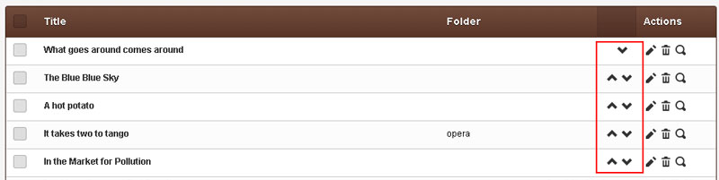

# CouchCMS v2.0

> **15 Jan 2017** *taken from https://www.couchcms.com/forum/viewtopic.php?f=5&t=10241*
>  
> This version of Couch has been promoted to become the release version 2.0 available from the main download page  [https://www.couchcms.com/products/](https://www.couchcms.com/products/) or [https://github.com/CouchCMS/CouchCMS/tree/v2.0](https://github.com/CouchCMS/CouchCMS/tree/v2.0)

Hi everybody,

Please allow me to present the elusive Couch v2.0

[couchcms-2.0b.zip](https://www.couchcms.com/forum/download/file.php?id=1405)

As has been discussed before in several threads, the salient feature of this version is the completely restructured admin panel.  
Once you install or upgrade to v2.0, the new admin-panel design you'll see is but the tip of the proverbial ice-berg that lurks beneath.

Almost every element that you see in the admin-panel can now be modified or completely replaced by your own design using the same Couch tags that we use on the front-end. So, for example, if you do not like the way the sidebar works just go ahead and replace it with your own version. If you wish to ditch the complete admin-panel design itself, be our guest and replace it with your own.

To explain in full details how to do all that, however, will require a full-fledged tutorial as extensive as the Aurelius tutorial we have for the front-end. I am, in fact, in the process of creating such a tutorial where we'll use an open-source admin-panel theme and make it completely replace the default theme. It seemed unreasonable to me to hold off the release of v2.0 awaiting the completion of the tutorial so, in this discussion, I'll try to only broadly outline the new theme system.

## Theming

Please try exploring the `'couch/theme/_system'` folder in the extracted source code.  
This is where all the `'snippets'` used to render the default admin-panel design reside.

I'd suggest you start with the `'main.html'` in there. Open it in your favorite text editor and you'll immediately see that this template serves as the base for all the admin pages. You'll also recognize the familiar Couch tags interspersed with normal HTML tags. You'll also come across several new tags (e.g. the `<cms:render />` tag) but, more or less, the code within the file should appear no different from what we have always used on normal front-end Couch templates.

You'll find the same to be true for all other snippets in the folder.  
I'd like to draw attention to one particular snippet - content_form.html. Open it in your editor and you should recognize that it is a standard `'Data-Bound Form'`. This particular snippet is used by the default admin panel to render *all* `'edit'` screens - be it for pages, drafts, folders, comments or users. So, I think, you'll find it interesting to note that **the same Data-bound form is used to edit all entities** in Couch now.

To render the `'list'` screens, each of the entities has its own separate snippet e.g. content_list_inner_gallery.html, content_list_inner_drafts.html, content_list_inner_folders.html etc. If you take a look at them, you'll find how we have used either `<cms:pages>` or `<cms:query>` to create the listings.

Okay, so now that we have seen that the snippets used for rendering all elements in the admin-panel are just regular Couch snippets, it should be easy to see that to modify any particular element we just need to modify the snippet rendering that element.

However, instead of directly modifying the snippets (in the `'_system'` folder) used by the system theme, **the correct method is to `'override'` them by creating your own theme**. Allow me to explain this concept a bit.

If you take a look at the `'couch/theme'` folder, you'll find a folder named `'sample'` that is a sibling of the `'_system'` folder. To create your own theme, you may either use this folder as-is or you may rename it (or create a new folder of any name of your choice within the `'themes'` folder).

Let us assume we use the `'sample'` as our custom theme. Edit 'couch/config.php' file and find the following line -

**Code:**

```html
// 26
// If the admin-panel uses a custom theme, set the following to the folder-name of the theme.
// Theme folder is expected to be within the 'couch/theme' folder. No leading or trailing slashes please.
//define( 'K_ADMIN_THEME', 'sample' );
```

Uncomment the last line (i.e remove the leading '//' from it) to activate your theme.  
In case you chose to rename the `'sample'` folder to something else, use that name in the setting instead.

And that is it. **With your theme activated, while rendering any element Couch will always check first if the snippet used to render it is present in the custom theme folder (`'sample'` in our example). If yes, it will use that snippet. Else, it will use the default from the `'_system'` folder.**

So you can see now, that to modify any particular element of the admin-panel, we can place its rendering snippet in our theme folder.  
Let us try it out. For our example, let us try and modify the outermost HTML of the admin-panel. We have already seen that the `'main.html'` snippet is used for rendering it. Instead of creating a blank new snippet in the `'sample'` folder, let us copy the existing `'main.html'` from the `'_system'` folder to the new location and modify it.

Edit the `'main.html'` copied to the new location and make some changes - you can change anything or everything you want but for this discussion let us just change the following line from -

**Code:**

```html
<a href="https://www.couchcms.com/">CouchCMS Version <cms:show k_cms_version /> (<cms:show k_cms_build />)</a>
```

to

**Code:**

```html
<a href="<cms:show k_site_link />">My CMS</a>
```

Visit the admin-panel and you should see that the link has changed. Congrats! Couch is now using your snippet to render the entire shell of the admin-panel.

Let us make some changes to the CSS styling next.  
You would have noticed that the `'sample'` folder already contained some files (three to be exact - styles.css, kfunctions.php and icons.php). Although all the three are optional and can be deleted if you don't require them, they can be useful later on so it is advisable to keep them.

The kfunctions.php file is useful when PHP code is required for advanced theming (we'll come to that in just a bit).  
The styles.css file, if it exists in the custom theme folder, is always included by Couch when rendering the `'main.html'` snippet. So, if you just wish to change the CSS styling of the admin-panel, you can simply put in your styles in this file and no overriding is required.

For our example, let us assume that we wish to include an additional CSS file (say, named 'sample.css' present in a folder named `'styles'`) in the admin-panel. Once you have created such a file, add the following at the appropriate location in `'main.html'` -

**Code:**

```html
<link href="<cms:show k_theme_link />styles/sample.css" rel="stylesheet"/>
```

You'll find that the `<cms:show k_theme_link />` statement gets resolved to your `'sample'` theme folder. Please notice that we use `<cms:show k_system_theme_link />` for accessing the system theme folder (i.e. 'couch/themes/_system').

So, hopefully now you can see how we can override and modify targeted sections of the admin-panel design.

## Advanced theming

There is much more to this overriding mechanism than what we have seen so far.

To give you a taste of it - till now we have seen that if a snippet (`'main.html'` in our example above) is present in the theme folder, it is chosen over the default snippet. What if we wanted this override to happen only for a particular logged-in user? Or only while editing a particular section (e.g. `'users'`)? Or only at a particular time of the day (joking :))? Not a problem. We can do all of that with just a bit of PHP thrown in the kfunctions.php file (details will be in the coming up tutorial).

Edit: You may see the following thread for an example of the kind of 'selective' overriding mentioned above - [viewtopic.php?f=2&t=10438&p=25693#p25693](https://www.couchcms.com/forum/viewtopic.php?f=2&t=10438&p=25693#p25693)

One more thing - if you take a look, for example, at the toolbar in the admin-panel while listing the pages of any cloned page, you'll likely see three buttons namely 'Add new', 'Manage folders' and `'View'`. The snippet that renders these buttons is 'toolbar.html'. If you take a look at it, you'll see how it outputs the markup for each button. However, you'll also notice that it is specified nowhere in the code that three buttons are to be rendered.  
It is actually looping through `<cms:admin_actions childof='toolbar'>` tag that feeds it with the number of toolbar buttons to render (exactly like we loop through `<cms:pages>`while rendering a list of pages). This arrangement makes it possible for addons (and also your PHP code) to tweak and set the buttons that are to be shown. For example, we could have a simple addon in the future that adds a 'Clone page' button to the toolbar.

This pattern of setting data elsewhere in the code and then using Couch tags in the snippets to render that data is all-pervasive in the current admin architecture. Almost everything that you see rendered has its data defined somewhere where it can be intercepted and tweaked at some point to make things work like never before. For example, the sidebar actually loops through data that can tweaked to add/hide/delete items conditionally. Same applies to the list of fields shown in the list page or the edit page.

I think the discussion so far would have made amply clear that nothing whatsoever in the current admin-panel architecture is 'set in stone', as was the case with the previous admin-panel. If I had to use a single word to describe what makes this admin-panel architecture different from the last one, it would be `'flexibility'`.

## Customizing the List screen

Apart from the theming mechanism briefly discussed above, v2.0 has several more handy methods for tweaking your admin-panel.  
Allow me to demonstrate this in a hands-on manner. Suppose you have a clonable Couch template named 'test.php' registered in your setup.  
Following is what its list screen might look like in the admin-panel -


Now please add the following code within its `<cms:template>` block -

**Code:**

```html
<cms:config_list_view>
    <cms:field 'k_selector_checkbox' />
    <cms:field 'k_page_title' />
</cms:config_list_view>
```

Visit the changed template as super-admin and come back to the admin-panel. You should see the following -


I think you can guess what the `<cms:config_list_view>` we added above is doing.  
To check it further, change the code to the following (we are swapping the position of the two `<cms:field>` tags) -

**Code:**

```html
<cms:config_list_view>
    <cms:field 'k_page_title' />
    <cms:field 'k_selector_checkbox' />
</cms:config_list_view>
```

Coming back to the admin-panel after the mandatory visit to the template as super-admin, following is what the list screen should look like -


So that should settle what the code we put above does - it defines the fields we want to show in the list screen and also their positions.  
One point to remember here is that if we skipped all the `<cms:field>` tags from the `<cms:config_list_view>` block e.g. as follows -

**Code:**

```html
<cms:config_list_view>

</cms:config_list_view>
```

\- it won't result in no fields being listed, as you might expect. Rather, it would make Couch revert back to showing the default set of fields.  
This default set of fields shown for a normal clonable template, when we do not explicitly specify the fields to display, is equivalent to the following code -

**Code:**

```html
<cms:config_list_view>
    <cms:field 'k_selector_checkbox' />
    <cms:field 'k_page_title' />
    <cms:field 'k_comments_count' />
    <cms:field 'k_page_foldertitle' />
    <cms:field 'k_page_date' />
    <cms:field 'k_actions' />
</cms:config_list_view>
```

For nested-pages, the default set of fields is just a tad different -

**Code:**

```html
<cms:config_list_view>
    <cms:field 'k_selector_checkbox' />
    <cms:field 'k_page_title' />
    <cms:field 'k_comments_count' />
    <cms:field 'k_up_down' />
    <cms:field 'k_actions' />
</cms:config_list_view>
```

As you can see, for nested-pages the `'k_page_date'` and `'k_page_foldertitle'` fields are removed while the `'k_up_down'` field (for manual sorting) gets added.

The `<cms:field>` tag accepts several parameters that can help us tweak the listing's display.  
For example, the code below will display `'Authors'`, instead of the default `'Title'`, for the second column of normal clonable template -

```html
<cms:config_list_view>  
    <cms:field 'k_selector_checkbox' />  
    <cms:field 'k_page_title' header='Authors' />  
    <cms:field 'k_comments_count' />  
    <cms:field 'k_page_foldertitle' />  
    <cms:field 'k_page_date' />  
    <cms:field 'k_actions' />  
</cms:config_list_view>
```


Sticking with the second column, instead of a self-closing tag, if we were to define it as a tag-pair e.g. as follows -

**Code:**

```html
<cms:config_list_view>
    <cms:field 'k_selector_checkbox' />

    <cms:field 'k_page_title' header='Authors' >
        <cms:repeat '3'>
            <cms:show k_page_title />
        </cms:repeat>
    </cms:field>

    <cms:field 'k_comments_count' />
    <cms:field 'k_page_foldertitle' />
    <cms:field 'k_page_date' />
    <cms:field 'k_actions' />
</cms:config_list_view>
```

\- you'll see that the content enclosed within the tag pair is used as the content displayed in the cells


In our example above, I rather sillily chose to repeat the page_title thrice, but the point I am trying to draw your attention to is that we had placed the code in the front-end template but it was *dynamically executed in the admin-panel's context*. This is powerful stuff as now we can use any Couch code, normally used on the front-end, to show the fields' content in the admin-panel.

Till now we have only played with the default set of system fields used by Couch for the listing.  
There is no problem at all if we put into the mix any custom fields (i.e. editable regions) we defined for the template.  
So, for example, supposing an editable region named `'my_text'` is defined in the template, the following would add a column to the page listing showing that field -

```html
<cms:config_list_view>  
    <cms:field 'k_selector_checkbox' />  
    <cms:field 'k_page_title' />  
    <cms:field 'my_text' header='Some text' />  
    <cms:field 'k_comments_count' />  
    <cms:field 'k_page_foldertitle' />  
    <cms:field 'k_page_date' />  
    <cms:field 'k_actions' />  
</cms:config_list_view>
```

Please notice that if we add a field as a self-closing tag, Couch will show the contents as a simple `<cms:show whatever_field_name />`. So, in the example above the following definition -

**Code:**

```html
<cms:field 'my_text' header='Some text' />
```

was equivalent to the following -

**Code:**

```html
<cms:field 'my_text' header='Some text' >
    <cms:show my_text />
</cms:field>
```

if the custom column requires some addition styling, we can add CSS classes to the header as follows -

**Code:**

```html
<cms:field 'my_text' header='Some text' class='my_text no-hide' />
```

Speaking of CSS styling, suppose we added the classes as shown above. Where do we add the CSS rules?  
One place, obviously, would be the 'styles.css' file in the theme folder we discussed earlier.  
Another could be right within the `<cms:config_list_view>` tag block where we defined `<cms:field />`s.  
Please take a look at the following -

**Code:**
```html
<cms:config_list_view>
    <cms:field 'k_selector_checkbox' />
    <cms:field 'k_page_title' />
    <cms:field 'my_text' header='Some text' class='my_text no-hide' />
    <cms:field 'k_comments_count' />
    <cms:field 'k_page_foldertitle' />
    <cms:field 'k_page_date' />
    <cms:field 'k_actions' />

    <cms:style>
        .col-my_text{
            width: 25%; important!
        }
    </cms:style>

</cms:config_list_view>
```

The `<cms:style>` block used within the `<cms:config_list_view>` above actually injects whatever is specified within it neatly within a HTML `<style>` block of the document's HEAD tag - do a view-source of the page to confirm this.

Curiously, the contents of the `<cms:style>` can be dynamic (i.e. can contain regular Couch tags), for example as follows -

**Code:**

```html
<cms:style>
    <cms:repeat '2' startcount='1'>
    .test{
        border:solid blue <cms:show k_count />px;
    }
    </cms:repeat>
</cms:style>
```

Please do a view-source to see its output.

The `<cms:style>` has two sibling tags that work very similarly - `<cms:script>` and `<cms:html>`.  
Consider the following code -

**Code:**

```html
<cms:config_list_view>

    <cms:style>
        <cms:repeat '2' startcount='1'>
        .test{
            border:solid blue <cms:show k_count />px;
        }
        </cms:repeat>
    </cms:style>

    <cms:script>
        <cms:repeat '3' startcount='1'>
        function test(){
            alert( 'Hello<cms:show k_count />' );
        }
        </cms:repeat>
    </cms:script>

    <cms:html>
        <cms:repeat '3' startcount='1'>
            <h<cms:show k_count />>Hello</h<cms:show k_count />>
        </cms:repeat>
    </cms:html>

</cms:config_list_view>
```

The `<cms:script>` tag injects its contents within a `<script type="text/javascript">` block at the end of the document.  
The `<cms:html>` tag injects its contents at the top of the content pane. Both tags, like `<cms:style>`, can contain dynamic contents.  
Please do a view-source to see the output of the code above.

A more practical example of <cms:html> tag's usage could be this -

**Code:**

```html
<cms:config_list_view>
    <cms:html>
        <cms:show_warning heading='Important' >
            Please do not delete any of these pages!
        </cms:show_warning>
    </cms:html>
</cms:config_list_view>
```


or this -

**Code:**

```html
<cms:config_list_view>
    <cms:html>
        <cms:show_info heading='' >
            These pages have been created automatically!
        </cms:show_info>
    </cms:html>
</cms:config_list_view>
```


Let us wrap up the customizing the list-screen topic with a related topic -

## Manually reorder normal cloned pages

As you know, the nested-pages have a useful feature where we can manually reorder them from the admin-panel.  
We can now do the same with normal cloned pages too. Here is how:

A little up we mentioned the default set of fields used by Couch to create the listing screens.  
If you recall, the set used for nested-pages had the following field normally not found in the other cloned pages.

**Code:**

```html
<cms:field 'k_up_down' />
```

To make a normal clonable template sortable manually, we can add the `'k_up_down'` field to it as follows -

```html
<cms:config_list_view  orderby='weight' order='asc'>  
    <cms:field 'k_selector_checkbox' />  
    <cms:field 'k_page_title'  sortable='0'  />  
    <cms:field 'k_comments_count' />  
    <cms:field 'k_page_foldertitle' />  
    <cms:field 'k_up_down' />  
    <cms:field 'k_actions' />  
</cms:config_list_view>
```

Just add the code above to any normal clonable template and it should become manually sortable



Please note the following points in the code above -

1\. We have replaced the default `'k_page_date'` field with `'k_up_down'`.  
2\. The `'k_up_down'` field works by tweaking the `'weight'` field of cloned pages.

For manual sorting to work, we need to display the pages always sorted by this weight field.  
We have done this by -

a. specifying the sort field (i.e. weight) as the `'orderby'` parameter of `<cms:config_list_view>` with the `'order'` set to `'asc'` (if needed, you can make this `'desc'`).

b. by default, Couch makes normal cloned pages sortable by the `'k_page_title'` and `'k_page_date'` fields (where we can click the header to sort by these fields). Since now it is necessary that the pages be sorted only by their weights, we have turned sorting by `'k_page_title'` off using the `'sortable'` parameter of `<cms:field>`. There is no `'k_page_date'` so we didn't need to do any such thing with it but if you choose to display date as well, make sure to turn off its sorting.

Making a `'gallery'` template manually sortable is even easier. Just use the following code somewhere in its `<cms:template>` block -

**Code:**

```html
<cms:config_list_view  orderby='weight'>
    <cms:field 'k_up_down' />
</cms:config_list_view>
```

**NOTE:**  
On the frontend, if are showing a list of pages and wish that listing to match the manually sorted order as displayed in the admin-panel, you'll have to use matching values for the `'orderby'` and `'order'` parameters of `<cms:pages>` tag e.g. as follows -

**Code:**

```html
<cms:pages orderby='weight' order='asc'>
    ...
</cms:pages>
```

Moving ahead with the discussion - you must have noticed above that the `<cms:config_list_view>` tag accepts parameters of its own that affect how the pages are listed.  We have already seen its `'orderby'` and `'order'` parameters. There are a few more that can come in useful -

**1\. `limit`**  
This sets the number of pages shown on a single screen when pagination is required. e.g.

**Code:**

```html
<cms:config_list_view  limit='20' />
```

**2\. `exclude`**  
Can be set to the (comma-separated) `'names'` of pages that are to be excluded from the listing.  
One use of this feature could be to exclude the vexing `'default'` page that Couch automatically creates for all clonable templates.  
Previously we had to resort to unpublish this default page and then rename it to something like 'PLEASE DO NOT DELETE' and hope that the warning is heeded. Now we can, after unpublishing the default page, rename it to something simpler like 'default-page' and then set the `'exclude'` parameter of  
`<cms:config_list_view>` to skip this page from the listing e.g.

**Code:**

```html
<cms:config_list_view  exclude='default-page' />
```

**3\. `searchable`**  
If this parameter is set to `'1'`, a search box appears above the page listing -

**Code:**

```html
<cms:config_list_view  searchable='1' />
```


It can be useful for templates that can potentially have a large number of pages.

> **Please be warned though**  - this search box uses the same `<cms:search />` tag as used on the front-end. As such, it suffers from the same limitation of not searching for words shorter than 4 characters (a limitation MySQL fulltext search). This might limit the usefulness of the search in certain cases.

With that we can move on to customizing the `'edit'` and 'create new' screens (lumped together as `'form'` screens).

## Customizing the Form screen

After having seen the `<cms:config_list_view />` tag above for customizing the list screen, you'd expect something similar for customizing the form screen as well and you won't be wrong. That tag is `<cms:config_form_view>`.

Just like its list screen counterpart, the `<cms:config_form_view>` is meant to be placed within a template's `<cms:template>` block.  
It also accepts as its child tags the `<cms:field>`, `<cms:style>`, `<cms:script>` and `<cms:html>` tags.  
The last three of the child tags named above work exactly the same as we saw them used in customizing the list screen above.  
The `<cms:field>` tag, however, works in a slightly different manner.

You'll recall from how we used `<cms:field>` tag while customizing the list screen above that it serves two purposes -

1. Defining which fields are displayed in the listing and in which order  
2. Customizing the look and contents of those fields.

While working with the form screen (i.e. while creating a new page or editing an existing one), you know that the fields shown are those defined in the template using the `<cms:editable>` tags. So, the first of the two purposes listed above is already covered. That leaves us with only the second purpose (i.e. customizing the look and contents) for which to use the `<cms:field>` tag while customizing the form screen.

In fact, the `<cms:editable>` tag also customizes the look and contents, to a certain extent (e.g. `'label'`, `'order'`, `'desc'` etc.), of the custom fields. Though the `<cms:field>` tag can be used to further tweak these custom fields, its real utility emerges in doing the same with `'system'` fields (e.g. name, title, folder, publish_date etc.) - something that was not possible before without serious bending over backwards. Let us see it in action.

Place the following within the `<cms:template>` block of any clonable template -

**Code:**

```html
<cms:config_form_view>
    <cms:field 'k_page_title' desc='hello!' label='Greetings!' order='100' group='_advanced_settings_' class='my_class' />
</cms:config_form_view>
```

Visit the template on the front-end as super-admin. Coming back to the admin-panel you should find that the `'Title'` field (the first displayed field, by default, in clonable templates) has disappeared! Worry not as we can find it now within the 'Advanced settings' dropdown -


Notice also how it is now showing a different label and description.

The parameters we used for the `<cms:field>` tag in the code above should be self-explanatory except, perhaps, the value used with the `'group'` parameter (i.e. `'_advanced_settings_'`). Actually, Couch by default groups together the fields seen on the form page into three separate groups -  
a. the system fields shown before the custom fields are placed within the `'_system_fields_'` group,

b. the system fields contained within the 'Advanced settings' dropdown are placed within the `'_advanced_settings_'` group

c. while all the custom fields defined by you fall within the `'_custom_fields_'` group.

Any custom groups you define (using type `'group'` editable region) are actually created as children of the `'_custom_fields_'` group with the fields within those custom groups then in turn falling beneath them - it's an hierarchical structure.

In the code above we simply used the `'group'` parameter to move the `'Title'` field from its default `'_system_fields_'` group to the `'_advanced_settings_'` group which made it move to the advanced settings dropdown. In fact, if you so wish you can move any system field from its default location to any custom `'group'` defined by you so as to place them anywhere on the screen e.g.

**Code:**

```html
<cms:field 'k_page_title'  group='my_group'  />
```


Admittedly, this is not something you'd normally like to do but the example above serves only to demonstrate what the various parameters of `<cms:field>` do.

There are three more parameters we can use with `<cms:field>`. A little word about each -

**`skip`**  
If set to `'1'` for a field, that field is not rendered at all on the screen.

**`hide`**  
If set to `'1'` for a field, that field (unlike `'skip'` above) is rendered but its visibility is set to hidden.

**`no_wrapper`**  
Normally when a field is rendered it comprises of two components -  
a. the field per se (e.g. the text input)  
b. enclosing markup e.g. the label, description, error message etc.  
With `'no_wrapper'` set to `'1'` for a field, the second component is skipped and only the naked field is rendered.

Speaking of the two components of a rendered field, till now we have seen the `<cms:field>` used as a self-closing tag.  
If, however, it is used as a tag-pair, then anything enclosed within the tags would be used to render the `'a'` component mentioned above.  
Try this -

**Code:**

```html
<cms:field 'k_page_title'>
    hello
</cms:field>
```


Of course that is silly :) Now try this -

**Code:**

```html
<cms:field 'k_page_title'>
    <cms:input name=k_field_name type='bound' trust_mode='1' />
</cms:field>
```

That should render the field as normal -


Basically when we use the `<cms:field>` as a self-closing tag e.g. like this -

**Code:**

```html
<cms:field 'k_page_title' />
```

- it is actually equivalent to this -

**Code:**

```html
<cms:field 'k_page_title'>
    <cms:input name=k_field_name type='bound' trust_mode='1' />
</cms:field>
```

I am sure you'll recognize the type `'bound'` `<cms:input>` in the code above.  
Anyway, point is that by using a tag-pair we can specify any custom markup for the field.  
This could be helpful in many cases e.g.

a. we can augment the type `'bound'` `<cms:input>` by adding custom elements around it

b. Please note that the enclosed content is dynamic and is actually executed in the context of the admin screen. We can use this, e.g. to make a type `'message'` editable region's contents dynamic (this required the use of snippets in previous Couch versions). So suppose we have defined a type `'message'` region named `'my_message'`. Placing the following within the same template's `<cms:config_form_view>` block will make that region show dynamic contents in the admin-panel -

**Code:**

```html
<cms:field 'my_message' >
    <cms:repeat '3' startcount='1'>
        <h<cms:show k_count />>Hello!</h<cms:show k_count />>
    </cms:repeat>
</cms:field>
```


c. an advanced use of this ability to put custom markup in fields would be to inject fields into the form that were never defined for the template.  
Please take a look at the following (somewhat advanced) code

**Code:**

```html
<cms:config_form_view>

    <cms:persist
        k_publish_date="<cms:if frm_my_publish_status='0'>0000-00-00 00:00:00<cms:else/><cms:show frm_my_publish_date /></cms:if>"
        _auto_title='1'
    />

    <cms:field 'my_publish_status'>
        <cms:input type='radio'
              name=k_field_input_name
              opt_selected="<cms:if k_page_date='0000-00-00 00:00:00' >0<cms:else />1</cms:if>"
              opt_values='Unpublished=0 || Published=1'
            />
    </cms:field>

    <cms:field 'my_publish_date' no_wrapper='1'>
        <div id="my-date-dropdown" style="margin-top: 6px; <cms:if k_page_date='0000-00-00 00:00:00' >visibility:hidden;</cms:if>">
            <cms:input
                name=k_field_input_name
                type='datetime'
                format='mdy'
                fields_separator=','
                default_time="<cms:if k_cur_form_mode='edit' && k_page_date!='0000-00-00 00:00:00'><cms:show k_page_date /><cms:else />@current</cms:if>"
                required='1'
            />
        </div>
    </cms:field>

    <cms:script>
        $( function(){
            $('#my_publish_status0').on('click', function(e){
                $('#my-date-dropdown').css('visibility', 'hidden')
            });
            $('#my_publish_status1').on('click', function(e){
                $('#my-date-dropdown').css('visibility', 'visible')
            });
        });
    </cms:script>

</cms:config_form_view>
```

The code above will result in the following being shown on the main screen.


Please notice that the new fields that you see on the screen are not defined anywhere as editable regions.  
Changes made to them, however, will be mirrored by the actual publish_date field in the advanced settings dropdown (try it).

A little explanation about the code -

The `<cms:field 'my_publish_status'>` and `<cms:field 'my_publish_date'>` fields, as already mentioned, are not defined as `<cms:editable>` in the template. We are simply using them to inject out custom markup as fields. We use the `'no_wrapper'` with the second field to make Couch skip outputting the label etc. for it as we'll be outputting that ourselves.

I am sure you'll recognize the `<cms:script>` tag from our previous discussion. We use it to inject some JS that handles how the two fields interact with each other.

Finally the new tag `<cms:persist>` - as you can see, the two fields above are injecting plain `<cms:input>`s into the form (i.e. not data-bound).  
So, although those inputs will accept data, throw validation errors etc. when it comes to saving the page, the databound form containing these inputs wouldn't know what to do with them. If you have worked with databound forms, you'll recall that we can explicitly set values of `<cms:db_persist_form>` tag in k_success condition as follows -

**Code:**

```html
<cms:form>

    <cms:if k_success>

        <cms:db_persist_form
            k_page_name = "<cms:random_name />"
            k_publish_date = '0000-00-00 00:00:00'
        />

        ..
        ..
    </cms:if>

    ..
```

In our case, however, the databound form is in the background and is not directly available. The `<cms:persist>` tag we used in our code above actually reaches out to that background databound form and injects its own parameters into the form's `<cms:db_persist_form>` tag.

So the following code we used above -

**Code:**

```html
<cms:persist
    k_publish_date="<cms:if frm_my_publish_status='0'>0000-00-00 00:00:00<cms:else/><cms:show frm_my_publish_date /></cms:if>"
    _auto_title='1'
/>
```

would be exactly the same as if we had used the following in the databound form -

**Code:**

```html
<cms:form>

    <cms:if k_success>

        <cms:db_persist_form
            k_publish_date="<cms:if frm_my_publish_status='0'>0000-00-00 00:00:00<cms:else/><cms:show frm_my_publish_date /></cms:if>"
            _auto_title='1'
        />

        ..
    </cms:if>

    ..
```

I think you can see that we are simply pushing the submitted values of our non-bound fields into the page being saved.

Realistically speaking, the example above is not of much practical utility because if we only wished to display the publish date field on the main screen, we could have simply used the following and the publish_date would move from the advanced settings dropdown onto the main screen (use `'order'` to tweak its position) -

**Code:**

```html
<cms:field 'k_publish_date' group='_custom_fields_'  />
```

The real utility of the example is in illustrating the power that we now have to tweak the form screen. I am sure there will be situations where you'd adapt the code above to do something we could never do in Couch before.

> **A CAVEAT:**  As you can see, we can now inject dynamic Couch code with wanton abandon within the admin panel. Sooner or later, it is bound to happen that you manage to introduce some malformed code that results in parsing error. When that happens, do not panic. All the code is controlled from the frontend template so simply temporarily remove whatever custom code you defined there and visit the template as super-admin. That should give you a blank slate on the admin side to begin experimentation again.

## Old Custom Admin Screens

You must have noticed that the customization of the list and form screens described in detail above essentially consisted of tweaking bits and parts of the screens as rendered in a default manner by Couch.

If for some cases, that tweaking is not sufficient you can take over the process from Couch completely and render yourself the full screens (as opposed to only parts as done so far).

If you have been with Couch for the past few versions, I am sure you know that previously this was done by the 'Custom Admin Screens' feature ([http://docs.couchcms.com/concepts/datab ... in-screens](http://docs.couchcms.com/concepts/databound-forms.html#custom-admin-screens)).

That feature has been retained in v2.0, although, strictly speaking going by how it worked, the term 'custom screen' seems redundant as now every screen in the new admin-panel is a custom screen :)

Anyway, let us see how it is done now in v2.0.  
The process is almost the same as before (actually has become easier) except for one change that I'll mention below.

Let us begin with the list screen first.

**Old method of custom list screen**  
Reiterating what the docs ([http://docs.couchcms.com/concepts/datab ... in-screens](http://docs.couchcms.com/concepts/databound-forms.html#custom-admin-screens))) said -  
To create a custom screen for the list view, create a snippet, say named 'my_list.html', and save it in the `'snippets'` folder of Couch (or in whichever folder you have configured to hold the snippets. If you've used the cms:embed tag this process will seem familiar).

For a quick test, let us put the following in the snippet -

**Code:**

```html
<cms:repeat '4'>
    <h3>Hello <cms:show k_template_title />!</h3>
</cms:repeat>
```

Next, edit the kfunctions.php file present in 'couch/addons' folder and place the following bit of code within it (replacing `'test.php'` with the actual template name the screen is being created)

**Code:**

```html
$FUNCS->register_admin_listview( 'test.php', 'my_list.html' );
```

Visit the admin-panel and access the 'test.php' template (or whatever template specified above). Here is what should appear -


This is where things differ a little from the previous versions.  
Previously, a list custom screen used to cover the following region -


Please notice how it was necessary before to include in your snippet code for the folders dropdown, the paginator and the actions at the bottom in addition to the code doing the actual listing.

Now the area covered by the custom list view has been constrained to the following -


So now your custom code needs to be concerned only with listing the pages in whatever manner is desired and not worry about the accessory functions.  
This eases things considerably as now you can focus on only the task at hand.

> **Note:**
> If, however, you do need to custom render the entire screen then go ahead and use the new `'theming'` technique. With that you can override anything and everything you wish.

Now go ahead and place the following in the 'my_list.html' snippet -

**Code:**

```html
<table class="table table-primary table-list">
    <thead>
        <tr>
            <cms:render 'list_header' />
        </tr>
    </thead>
    <tbody id="listing">
        <cms:pages
                masterpage       = k_template_name
                id               = k_selected_pageids
                folder           = k_selected_foldername
                orderby          = k_selected_orderby
                order            = k_selected_order
                custom_field     = k_selected_custom_field
                paginate         = '1'
                limit            = k_selected_limit
                show_unpublished = '1'
                page_name        = "<cms:if k_selected_exclude>NOT <cms:show k_selected_exclude /></cms:if>"
                start_on         = k_selected_start_on
                stop_before      = k_selected_stop_before
                base_link        = k_route_link
                token            = k_cur_token
            >

            <cms:if k_paginated_bottom >
                <cms:set my_paginator="<cms:render 'paginator' />" 'parent' />
            </cms:if>

            <tr>
                <cms:render 'list_row' />
            </tr>

        </cms:pages>
    </tbody>
</table>
```

You'll see that now the list screen renders *exactly* the same as the default listing.


Hardly surprising as I have lifted the code above straight from 'couch/theme/_system/content_list_inner.html' snippet that is used by the theme layer to render the normal listing pages (check it).

You can now hardcode within the `<tr></tr>` whatever `<td>`s you want (or ditch the table layout and show the listing in whatever way you desire).

Let us now move to how the old method of custom edit screen can now be implemented.

**Old method of custom edit screen**  
There are no breaking changes here (things have actually become simpler e.g no need to code the advanced settings dropdown).  
Again reiterating from the original docs ([http://docs.couchcms.com/concepts/datab ... dit-screen](http://docs.couchcms.com/concepts/databound-forms.html#custom-edit-screen)),  
begin by creating a snippet file in Couch's snippets folder and then registering it for the template in kfunctions.php.  
Assuming the snippet we use is named `'my_edit.html'`, this is what needs to be placed in `kfunctions.php` -

**Code:**

```html
$FUNCS->register_admin_pageview( 'test.php', 'my_edit.html' );
```

To do the preliminary test, place just the following in the `'my_edit.html'` snippet -

**Code:**

```html
<cms:dump_all />
```

In the admin-panel, clicking on any cloned page of the template to edit it will now load the snippet above and you should see the dump showing all the variables available.

With that tested as working, replace the contents of the snippet with the following -

**Code:**

```html
<cms:form
    masterpage = k_selected_masterpage
    mode = k_selected_form_mode
    page_id = k_selected_page_id
    enctype = 'multipart/form-data'
    method = 'post'
    anchor = '0'
    add_security_token = '0'
    id = k_cur_form
    name = k_cur_form
    token = k_cur_token
    >

    <div class="tab-pane fade active in" id="tab-pane-edit-<cms:show k_route_module />">

        <cms:if k_success >

            <cms:db_persist_form
                _token=k_cur_token
            />

            <cms:if k_success >
                <cms:if k_redirect_link >
                    <cms:set_flash name='submit_success' value='1' />
                    <cms:redirect k_redirect_link />
                </cms:if>
            </cms:if>
        </cms:if>

        <cms:if k_error >
            <cms:show_error>
                <cms:each k_error >
                    <cms:show item /><br>
                </cms:each>
            </cms:show_error>
        </cms:if>

        <cms:render 'group_advanced_settings' />

        <!-- custom editable regions begin -->

        <!-- custom editable regions end -->

        <div class="ctrl-bot">
            <cms:render 'page_actions' />
        </div>

        <input type="hidden" id="k_custom_action" name="k_custom_action" value="">
    </div>
</cms:form>
```

That is the bare essential shell required for the proper rendering of the edit screen (has been adapted from the 'couch/theme/_system/content_form.html' snippet that is used by the theme layer to render the normal form screens).

Test it and you'll get a fully functional (albeit showing no fields in the main screen) form screen complete with the advanced settings dropdown.

You can now out your bound inputs within the block marked as follows above.

**Code:**

```html
<!-- custom editable regions begin -->

<!-- custom editable regions end -->
```

One sample implementation for reference -

**Code:**

```html
<!-- custom editable regions begin -->
 <div id="my_wrapper">  
        <div id="k_page_folder_id" class="k_element">
            <b>Manufacturer:</b><br>
            <cms:input type='bound' name='k_page_folder_id'  />
        </div>

        <div id="k_page_title" class="k_element">
            <b>Model:</b><br>
            <cms:input type='bound' name='k_page_title'  />
        </div>

        <div id="image" class="k_element">
            <b>Photo:</b><br>
            <cms:input type='bound' name='image'  />
        </div>  
</div>
<!-- custom editable regions end -->
```

To style the custom fields, you can use the following in the snippet below the form

**Code:**

```html
<cms:admin_add_css>
    /* for example */
    label{
        font-size: 16px;
        padding-top: 10px;
    }
</cms:admin_add_css>
```

If some custom JS is required, use the following -

**Code:**

```html
<cms:admin_add_js>
    /* for example */
    $(function(){
        // ..
    });
</cms:admin_add_js>
```

The two tags above work just the same as the `<cms:style>` and `<cms:script>` tags we used earlier within the `<cms:config_list_view>` and `<cms:config_form_view>` tag blocks - the crucial difference being that the latter are used within frontend templates but inject their contents in the backend admin-panel while the former are used directly within backend snippets (like the 'my_edit.html' above).

You'll find the `<cms:admin_add_css>` and `<cms:admin_add_js>` tags being used pretty extensively by the theme layer snippets (i.e. those within 'couch/theme/_system/') used by Couch to render the admin panel.

Ok, so that wraps up our custom admin screens section.

What else remains to be covered?  
Oh, there is one feature that has to be termed as the most requested feature of all time -

## Grouping templates in the sidebar

If you take a look at the sidebar in the admin-panel, you'll see that by default all the items listed in it are placed in two groups.  
All the regular front-end templates are grouped under `'Templates'` while all the system modules (e.g. users, drafts and comments) are grouped under `'Administration'`. Internally, the two groups are known as `'_templates_'` and `'_modules_'` respectively.

Now try the following -  
Edit any of your front-end template (we are using test.php in our example) and place the following in its `<cms:template>` tag definition -

```html
<cms:template clonable='1' title='Test' parent='_modules_'>
```

Visit the template as super-admin for the change to persist.  
Coming back to the admin-panel, you should now see that your template is now placed in the `'Administration'` group along with the system modules.


I think you can see what has happened. The code we added to the `<cms:template>` specified the `'parent'` group of the template as `'_modules_'` (i.e. `'Administration'`) and that is where the template ended up moving from its default `'_templates_'` (i.e. `'Templates'`) group.

So, if we could somehow add a new group to the two existing default groups, it should be easy to place any template within that group simply by specifying the group's name as the template's `'parent'`. Let us do just that.

Edit your 'couch/addons/kfunctions.php' file and add the following to it -

```html
if( defined('K_ADMIN') ){
    $FUNCS->add_event_listener( 'register_admin_menuitems', 'my_register_admin_menuitems' );

    function my_register_admin_menuitems(){
        global $FUNCS;

        $FUNCS->register_admin_menuitem( array('name'=>'_my_test_', 'title'=>'Test', 'is_header'=>'1', 'weight'=>'1')  );

    }
}
```

The important line in the code above is this -

**Code:**

```html
$FUNCS->register_admin_menuitem( array('name'=>'_my_test_', 'title'=>'Test', 'is_header'=>'1', 'weight'=>'1')  );
```

Come to the admin-panel and you should see a third group added to the sidebar.


As I am sure you can make out, the `'title'` we set above is used for displaying the group in the sidebar while the `'weight'` decides where amongst all other groups it is situated (incidentally, the default weight of `'_templates_'` is 0 while that of `'_modules_'` is 10. So the `'1'` we set for our custom group makes it fall between the two).

We can now use the `'name'` we set for our new group (`'_my_test_'`), with any template (test.php in our example) e.g.

```html
<cms:template clonable='1' title='Test'  parent='_my_test_'>
```


By default, a template's entry is shown with an icon of `'layers'` if it is a clonable template and with no icon at all if it is not.  
You can specify which icon to use by setting it in the `<cms:template>` tag e.g. as follows -

```html
<cms:template clonable='1' title='Test' parent='_my_test_'  icon='audio-spectrum'>
```


> **INFO:**  
> So which icon names can we use? For now, any of those listed here -  [https://useiconic.com/open#icons](https://useiconic.com/open#icons)  
> Those are the names used by Open Iconic icon set used by the default system theme. If any custom theme decides to use another icon set, it will have to provide a `'translation'` between the two sets. Please see the icons.php file found in the sample theme (couch/theme/sample)

Not too difficult, eh?  
Just to make sure that you get the PHP syntax right, let us add another group to the sidebar and we can then wrap up this topic -

**Code:**

```html
if( defined(`'K_ADMIN'`) ){
    $FUNCS->add_event_listener( 'register_admin_menuitems', 'my_register_admin_menuitems' );

    function my_register_admin_menuitems(){
        global $FUNCS;

        $FUNCS->register_admin_menuitem( array('name'=>'_my_test_', 'title'=>'Test', 'is_header'=>'1', 'weight'=>'1')  );
        $FUNCS->register_admin_menuitem( array('name'=>'_my_another_test_', 'title'=>'Another Test', 'is_header'=>'1', 'weight'=>'2')  );

    }
}
```

To add another group, simply copy the full $FUNCS->register_admin_menuitem line and paste it below the last such line. Then make sure you change at least the `'name'` parameter.

> At this point it might cross your mind - how to change the title of the two default menu-groups?  
> We could do that using some PHP code in kfunctions.php but I think you'd find it easier to do so by editing the 'couch/lang/EN.php' file where you'll find their texts listed as -  
>
> `$t['menu_templates'] = 'Templates';`  
> `$t['menu_modules'] = 'Administration';`

For a real-world example of further customizing the sidebar to accommodate a large number of templates, please see the following post - [viewtopic.php?f=8&t=11547](https://www.couchcms.com/forum/viewtopic.php?f=8&t=11547)

## Misc.

There are several small changes but two deserve a proper mention.

1\. As you, of course, know that all Couch tags are executed only on the server side and the parser removes them from the outputted HTML that is served to the browser. As long time Couch users would have noticed, this removal of the Couch tags used to leave behind some very characteristic white-spaces in the output (seen with a view-source://). White spaces do not affect how HTML renders in the browser so this was not a big issue but the white-spaces did seem disconcerting to anyone taking a look at the generated source code.

Couch v2.0 fixes that and it does that following the exact method used by the PHP parser.  
Now any Couch tag that has a newline immediately following its terminal '>' bracket, will get the newline removed.

This improves the readability of the generated code considerably.  
However, there is one place where this can break existing code (which is actually the reason for discussing this change).

The `<cms:send_mail>` tag (while sending plain text emails) relies upon the presence of newlines in its enclosed contents to format the email correctly.  
For example, in previous versions of Couch the body of the email send by the following code -

**Code:**

```html
<cms:send_mail from="xyz@xyz.com" to="abc@abc.com" subject='Feedback from your site'>
    The following is an email sent by a visitor to your site:
    <cms:show frm_name />
    <cms:show frm_email />
</cms:send_mail>
```

- could look like this

**Code:**

```html
    The following is an email sent by a visitor to your site:
    John Doe
    john@doe,com
```

With v2.0 now stripping off the newlines, the body of the email would now turn up as follows -

**Code:**

```html
    The following is an email sent by a visitor to your site:    John Doe    john@doe,com
```

That is definitely cause for concern but worry not! It is trivial to fix that.  
The fix lies in the `'immediately'` of the statement I made above -

> Now any Couch tag that **has a newline immediately following its terminal '>' bracket**, will get the newline removed.

To prevent Couch from stripping off the newlines we need after the Couch tags, we simply need to place some space characters (even a single character will do) immediately after the closing '>' (just press the spacebar). By doing so, the newline does not come immediately after the tag and is hence not stripped away.  
This, incidentally, is precisely how PHP parser works while stripping off PHP tags from source code.

This is a breaking change introduced with v2.0 that will necessitate your taking some corrective actions on existing code.

2\. The second change is rather cosmetic but should be a welcome one.

It concerns the way `<cms:editable>` regions are grouped together.  
Till now we had to use something like this to do so -

**Code:**

```html
<cms:editable name='prop_uploads' label='Uploads' desc='Your main uploads' type='group' />

<cms:editable name='prop_image' label='Image' desc='Upload main image here' show_preview='1'
    group='prop_uploads'
    type='image' />

<cms:editable name='prop_document' label='Downloadable File' desc='Upload the file here'
    group='prop_uploads'
    type='file' />
```

As you can see above, the type `'group'` region is defined separate from the regions it encloses and then the two are linked together using the group=`'prop_uploads'` statement.

With v2.0, now we can use the following to achieve the same results -

**Code:**

```html
<cms:editable name='prop_uploads' label='Uploads' desc='Your main uploads' type='group'>

    <cms:editable name='prop_image' label='Image' desc='Upload main image here' show_preview='1' type='image' />

    <cms:editable name='prop_document' label='Downloadable File' desc='Upload the file here' type='file' />

</cms:editable>
```

The group region can now be defined explicitly enclosing the regions contained within it (i.e. using a tag-pair syntax) and the child regions no longer have to use the `'group'` parameter. Way cleaner than the original, right?

One more new feature has been added to the type `'group'` editable region.  
With multiple groups in the same template, Couch shows only the first group in an expanded state. The rest are all shown collapsed.  
You can override this default behaviour by setting the `'collapsed'` parameter. For example, the following will always show the defined group in an initially expanded state no matter what its position is amongst other groups -

```html
<cms:editable name='prop_uploads' label='Uploads' desc='Your main uploads' type='group' collapsed='0'>
```

Vice versa, you can set the parameter to `'1'` to always show a group in an initially collapsed state.

## The End (of this discussion)

So with that this particular discussion finally comes to an end.

The new admin-panel architecture finally makes possible the creation of more powerful and flexible addons/modules that can interact with and modify the admin-panel without requiring any change to existing code. You can expect some pretty radical addons soon (the repeatable-region addon is first in line for a total make-over).

For now, please try out this version and let me know how your thoughts on it.  
I sincerely hope you find it useful - would make the toil of the past so many months worthwhile for me :)

Thanks.

Credits:  
@cheesypoof - for the meticulous admin-panel design,  
@trendoman - for painstakingly weeding out bugs pre-release,  
Everyone - for your unflagging support :)
Thank you.
