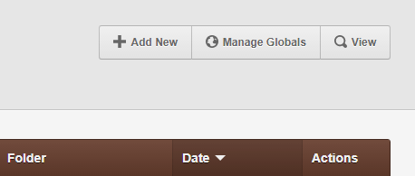
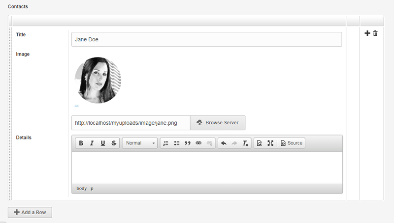
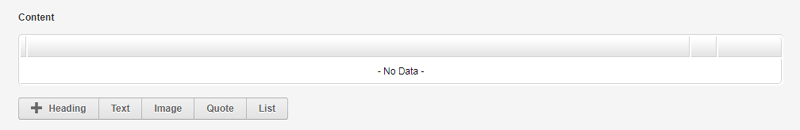
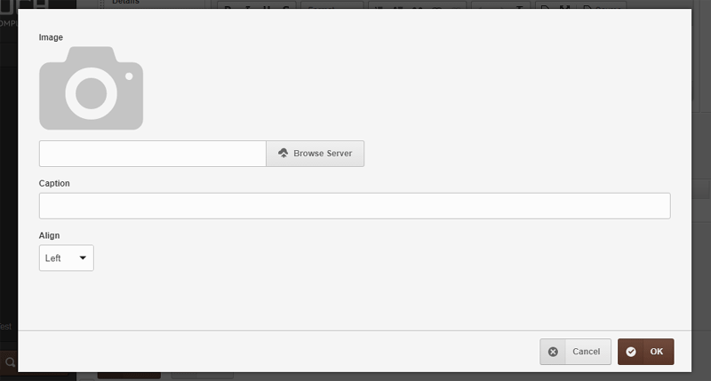
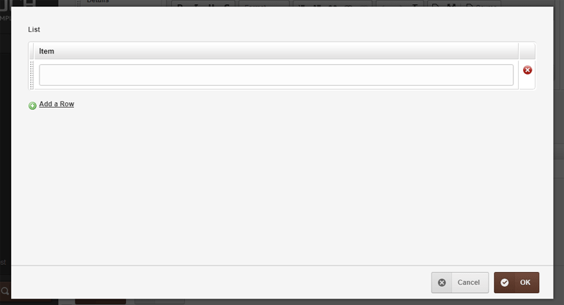
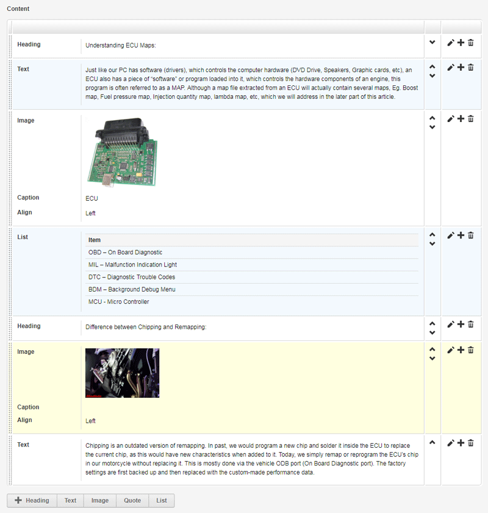
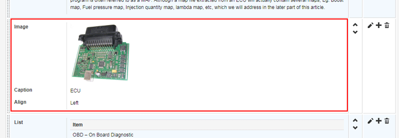
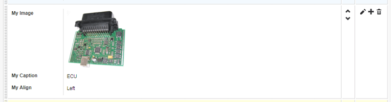
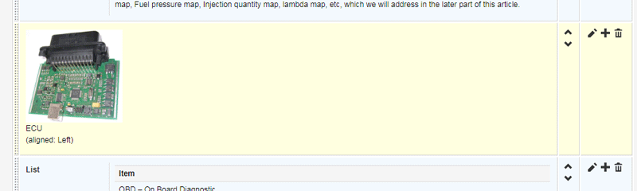

# CouchCMS v2.1

> **11 May 2018**  *taken from https://www.couchcms.com/forum/viewtopic.php?f=5&t=11105*
>
> This version of Couch has been promoted to become the release version 2.1 available from the main download page  [https://www.couchcms.com/products/](https://www.couchcms.com/products/) or [https://github.com/CouchCMS/CouchCMS/tree/v2.1](https://github.com/CouchCMS/CouchCMS/tree/v2.1)

Hi everybody,  
  
Time for the next version of Couch - v2.1 (for now in beta) -  
[https://github.com/CouchCMS/CouchCMS](https://github.com/CouchCMS/CouchCMS)  
  
The salient feature of this release is its handling of repeated contents but before we get to that, let us see the lesser features first.  
  
## 1\. `<cms:get_field>` tag  
  
This tag replaces the existing `<cms:get_custom_field>` tag which is now deprecated (will still work but will internally switch over to the new tag).  
Unlike the `<cms:get_custom_field>` tag, this new tag works with almost all custom field types and also system fields. It takes the same parameters as its older counterpart but can also be used as a tag-pair (shown in the last example below).  
  
Examples -  

**Code:**

```html
<cms:get_field 'address' masterpage='contact.php' />
```

The code above is for non-clonable templates. The example fetches the `'address'` field from `'contact.php'` template.  
  
**Code:**

```html
<cms:get_field 'content' masterpage='news.php' page='some-news' />
```

The code above is for clonable templates. The example fetches the `'content'` field from a page named `'some-news'` belonging to the ``'news.php'`` template.  
  
**Code:**

```html
<cms:get_field 'images' masterpage='news.php' page='some-news' >
    <cms:show_repeatable k_field_name >
        ..
    </cms:show_repeatable>
</cms:get_field>
```

Code above fetches a 'repeatable-region' named 'images' from a clonable template's page.  
Please notice that this was not possible with <cms:get_custom_field>.  
  
## 2\. Template globals  

Long time users of Couch will no doubt be familiar with the following conundrum peculiar to clonable templates -  
what to do if you wish to display some editable data in the 'home-view' of a clonable-template?  
  
Defining editable-regions for this in the template itself will not work as those get associated with the cloned-pages of the template (and so become available only in 'page-views'). What we need are editable-regions unique and specific only to the home-view (i.e. global to the entire template).  
  
The solution so far has been to use a separate non-clonable template (conventionally named `'globals.php'`) and define editable-regions there. More often than not, editable-regions of several clonable templates would be defined in the global template.  
  
The approach above would still work but now we have a better way of defining such template globals.  
Suppose following is the cms:template block from one clonable template -  

**Code:**

```html
<cms:template title='News' clonable='1'>
    <cms:editable name='content' label='Content' type='richtext' />
    <cms:editable name='summary' label='Summary' type='textarea' height='80' />
</cms:template>

```

The two regions defined above will, of course, be available for only pages.  
Now modify the block to make it as follows -  

**Code:**

```html
<cms:template title='News' clonable='1'>
    <cms:editable name='content' label='Content' type='richtext' />
    <cms:editable name='summary' label='Summary' type='textarea' height='80' />

    <cms:globals>
        <cms:editable name='caption' label='Caption' type='text' />
        <cms:editable name='intro' label='Introductory Text' type='richtext' />
    </cms:globals>
</cms:template>

```

As you can see, we are using a <cms:globals> block to isolate the definition of some editable regions.  
Visit the modified template as super-admin and you'll find that Couch has added a new button in the list-view -  



Click it and you'll see the editable regions we defined above within <cms:globals> ready for accepting inputs.  
  
Once data has been inputted, following is how you can display it back on the front-end -  

**Code:**

```html
<cms:get_global 'caption' />
```

**Code:**

```html
<cms:get_global 'intro' />
```

For more complex fields (e.g. repeatable-regions), we can use the cms:get_global tag as a tag-pair e.g. as follows -  

**Code:**

```html
<cms:get_global 'images'>
    <cms:show_repeatable k_field_name >
        ..
    </cms:show_repeatable>
</cms:get_global>

```

Instead of fetching values of single fields, as we did above, we can fetch all globals in a single go using the <cms:show_globals> tag as follows -  

**Code:**

```html
<cms:show_globals>
    <cms:show caption />
    <cms:show intro />
</cms:show_globals>

```

In all the examples above, we have been displaying the data on the very same template where the regions were defined.  
The same data can, however, be displayed absolutely anywhere on the site by specifying the `'masterpage'` parameter.  
  
For example, suppose the name of the template we defined the globals above was `'news.php'`, we can place the following code in another template, say `'index.php'`, and it will display the global data of news there -  

**Code:**

```html
<cms:get_global 'caption' masterpage='news.php' />

<cms:get_global 'intro' masterpage='news.php' />

<cms:show_globals masterpage='news.php' >
    <cms:show caption />
    <cms:show intro />
</cms:show_globals>

```

Let us now move on to the revised take on repeatable contents I spoke of at the beginning.  
  
## 3\. Revised repeatable-regions  
  
There is one major change to the existing repeatable-regions.  
  
As I am sure you must have experienced, with many editables defined as repeatable it becomes unwieldy to show them all in a single row.  
For such situations, we can now ask Couch to display the regions stacked vertically (instead of horizontally in a row).  
Try the following -  

**Code:**

```html
<cms:repeatable name='contacts' label='Contacts' stacked_layout='1'>
    <cms:editable name='title' label='Title' type='text' />
    <cms:editable name='image' label='Image' type='image' show_preview='1' preview_width='200' />
    <cms:editable name='details' label='Details' type='richtext' height='80' />
</cms:repeatable>

```

The code above is a regular definition of repeatable-regions.  
The only point I'd like to draw your attention to is the `stacked_layout='1'` parameter.  
  
Following is how the code renders in the admin-panel -  



That covers the changes on the back-end. The `<cms:show_repeatable>` tag used on the front-end to display the inputted data also has some changes.  
It has three new parameters - `'limit'`, `'offset'` and `'order'`.  
Setting the `'order'` parameter to `'desc'` will make the tag show the rows in reverse order -  

**Code:**

```html
<cms:show_repeatable 'contacts' order='desc' >..
```

The `'limit'` parameter will make the tag show only the specified number of rows -  

**Code:**

```html
<cms:show_repeatable 'contacts' limit='3' >..
```

The `'offset'` parameter will make the tag to begin showing the rows after skipping the number of rows specified in offset -  

**Code:**

```html
<cms:show_repeatable 'contacts' offset='2' >..
```

Using a combination of the three can be useful to target a specific row in the table e.g.  
the following will show only the very first row -  

**Code:**

```html
<cms:show_repeatable 'contacts' limit='1' >..
```

The following will show only the second row -  

**Code:**

```html
<cms:show_repeatable 'contacts' limit='1' offset='1'>..
```

the following will show only the last row -  

**Code:**

```html
<cms:show_repeatable 'contacts' limit='1' order='desc' >..
```

while the following will show only the second-last row -  

**Code:**

```html
<cms:show_repeatable 'contacts' limit='1' offset='1' order='desc' >..
```

Two new variables are also made available while looping through the rows in repeatable-regions -  

**Code:**

```html
<cms:show_repeatable 'contacts'>
    <cms:if k_first_row >
        ..
    </cms:if>

    ..

    <cms:if k_last_row >
        ..
    </cms:if>
</cms:show_repeatable>

```

That brings us to the last item of this discussion which, for me, is the defining feature of Couch v2.1 -  
  
## 4\. Mosaic  
  
You are familiar with how repeatable-regions work - we define a set of editable regions and then every time we click the `'Add'` button a fresh row containing the defined repeatable regions is added to the table. Point being stressed here is that, notwithstanding the number of rows in the table, each and every one of the row contains exactly the *same* editable regions.  
  
Depending on the use-case, this arrangement could be perfect.  
However, some use-cases demand more flexibility - where each row could have a *different* set of editable-regions.  
  
Enter the big brother of repeatable-regions - the Mosaic.  
  
Mosaic allows you to define different sets of editable regions (each set is known in Couch parlance as a `'Tile'`).  
The client then, instead of a single `'Add'` button of traditional repeatable-regions, is shown as many buttons as there are tiles defined.  
This way she can choose to add to the table (mosaic) any number of structurally distinct rows (tiles) thus composing layouts of any complexity.  
  
Take a look at the following example definition of a mosaic (remember, just like repeatable-regions, a mosaic needs to be defined within the `<cms:template>` block -  

**Code:**

```html
<cms:template>
    ..

    <cms:mosaic name='content' label='Content'>
        <cms:tile name='heading' label='Heading'>
            <cms:editable name='heading' label='Heading' type='text' />
        </cms:tile>

        <cms:tile name='text' label='Text'>
            <cms:editable name='text' label='Text' type='richtext' toolbar='basic' />
        </cms:tile>

        <cms:tile name='image' label='Image'>
            <cms:editable name='image' label='Image' type='image' show_preview='1' preview_width='150' />
            <cms:editable name='caption' label='Caption' type='text' />
            <cms:editable name='align' label='Align' opt_values='Left | Center | Right' type='dropdown'/>
        </cms:tile>

        <cms:tile name='quote' label='Quote'>
            <cms:editable name='quote' label='Quote' type='textarea' height='80'  />
            <cms:editable name='author' label='Author' type='text' />
        </cms:tile>

        <cms:tile name='list' label='List'>
            <cms:repeatable name='list' label='List'>
                <cms:editable name='item' label='Item' type='text' />
            </cms:repeatable>
        </cms:tile>
    </cms:mosaic>

    ..
</cms:template>

```

In the code above we are defining five tiles - each tile representing a discrete structural element of long form content (heading, text, image, quote and list in this example).  
  
Please notice that we can define any number of tiles and any number of editable-regions within each tile (our example has been purposefully kept simple). Please also notice that the last tile contains a repeatable-region as its constituent. So, finally, mosiac also allows us to `'repeat'` repeatable-regions.  
  
Coming back to the admin-panel after visiting the template as super-admin, you should find that our code above produces the following -  



As you can see, there are five buttons below the (as yet) empty table representing the five tiles we defined in our mosiac.  
  
Try clicking on the buttons and you should see the editable-regions defined for each tile showing up in a popup -  





Here you'll notice that, unlike repeatable-regions, mosaic rows (tiles) offer their editable regions for editing in popups.  
This is a conscious architectural decision as this allows the mosaic to support every current editable region available (except another mosaic) and also all future ones to come. This is in stark contrast to editable-regions that allow only a sub-set.  
  
After going ahead and adding some tiles to the mosaic, this is what it looks like -  



As you can see, mosaic has tried to render the non-editable version of your inputted data using its defaults.  
If that does not suit you, you may specify your own markup to use for the rendering of any tile.  
  
You might recall from the docs of Couch v2.0 ([viewtopic.php?f=5&t=10241](https://www.couchcms.com/forum/viewtopic.php?f=5&t=10241)), we can override the way Couch renders the listing of pages in admin-panel using `<cms:config_list_view>`. The same tag can be used with individual `<cms:tile>` blocks too.  
  
For our example, we'll target only the `'image'` tile. Following is how the config tag needs to be used (we haven't specified any overriding markup yet) -  

**Code:**

```html
<cms:tile name='image' label='Image'>
    <cms:editable name='image' label='Image' type='image' show_preview='1' preview_width='150' />
    <cms:editable name='caption' label='Caption' type='text' />
    <cms:editable name='align' label='Align' opt_values='Left | Center | Right' type='dropdown'/>

    <cms:config_list_view>
        <cms:field 'k_content' >
            ...
        </cms:field>
    </cms:config_list_view>
</cms:tile>

```

The `'k_content'` field we'd be specifying the custom markup for is the following area in each row -  



Let us now put in our own markup -  

**Code:**

```html
<cms:config_list_view>
    <cms:field 'k_content' >
        <div class="mosaic-list">
            <div class="row">
                <div class="cell cell-label col-md-2">
                    <label>My Image</label>
                </div>
                <div class="cell cell-content col-md-10">
                    <div class="field-content">
                        <a class="img-popup" href="<cms:show image />">
                            " width="150">
                        </a>
                    </div>
                </div>
            </div>

            <div class="row">
                <div class="cell cell-label col-md-2">
                    <label>My Caption</label>
                </div>
                <div class="cell cell-content col-md-10">
                    <div class="field-content">
                        <cms:show caption />
                    </div>
                </div>
            </div>

             <div class="row">
                <div class="cell cell-label col-md-2">
                    <label>My Align</label>
                </div>
                <div class="cell cell-content col-md-10">
                    <div class="field-content">
                        <cms:show align />
                    </div>
                </div>
            </div>
        </div>
    </cms:field>
</cms:config_list_view>

```

Visit the modified template as super-admin for the change to persist. Coming back to the admin-panel, you should see the `'image'` tile being displayed as follows -  



That might look like nothing has changed but please notice the captions - they show our "My xyz" versions.  
So our change is indeed taking effect; it is only that the markup I used above is the same as that use by mosaic as default (each region in a separate row).  
Now that you know how to override the markup, feel free to use anything you like e.g. following is a pretty crude layout -  

**Code:**

```html
<cms:config_list_view>
    <cms:field 'k_content' >
        <div class="mosaic-list">
            <div class="row">
                <div class="cell cell-label col-md-12">

                    <a class="img-popup" href="<cms:show image />">
                        " width="150">
                    </a>
                    <cms:show caption /><br>
                    (aligned: <cms:show align />)

                </div>
            </div>
        </div>
    </cms:field>
</cms:config_list_view>

```

Which displays as -  



Using this technique you may style all the elements in the tiles to look similar to what they'd do on the frontend e.g. the heading could be wrapped up in `<h2>`, the quotes in `<blockquote>` etc.  
I think you get the point :)  
  
> **Note:**
> Just one thing to keep in mind - the `<cms:style>` tag won't work if used within the `</cms:config_list_view>` block of a tile.  
> If you need to style the markup of a tile (the default or your custom), you'll have to use the `<cms:style>` tag placed within the `</cms:config_list_view>` block of the parent `<cms:template>` tag of the containing template.

Moving ahead, the use of `<cms:config_list_view>` above might make you think that we can also use its counterpart `<cms:config_form_view>` tag to override the markup used in the editing form (within a popup in mosaic's case). And you know what? You'd be correct. Please see the v2.0 docs ([viewtopic.php?f=5&t=10241](https://www.couchcms.com/forum/viewtopic.php?f=5&t=10241)) for details as it would work the same here.  
  
Finally, with our data inputted into mosaic, time to display it on the frontend.  
The tag to use is `<cms:show_mosaic>` which, given the name of a mosaic, loops though all its rows making their data available for further use by your code. The primary thing to do in your code is to identify which tile the current row being iterated belongs to.  
Following is some skeletal code to begin with -  

**Code:**

```html
<cms:show_mosaic 'content'>
    <cms:if k_tile_name='heading' >
        ..
    </cms:if>

    <cms:if k_tile_name='text' >
        ..
    </cms:if>

    <cms:if k_tile_name='image' >
        ..
    </cms:if>

    <cms:if k_tile_name='quote' >
        ..
    </cms:if>

    <cms:if k_tile_name='list' >
        ..
    </cms:if>
</cms:show_mosaic>

```

Within each tile specific block we chalked out above, we can put markup specific to that tile e.g.  

**Code:**

```html
<cms:show_mosaic 'content'>
    <cms:if k_tile_name='heading' >
        <h3><cms:show heading /></h3>
    </cms:if>

    <cms:if k_tile_name='text' >
        <div>
            <cms:show text />
        </div>
    </cms:if>

    <cms:if k_tile_name='image' >
        " alt="<cms:show caption />" />
    </cms:if>

    <cms:if k_tile_name='quote' >
        <blockquote>
            <cms:show quote />
        </blockquote>
    </cms:if>

    <cms:if k_tile_name='list' >
        <ul>
        <cms:show_repeatable 'list' >
            <li><cms:show item /></li>
        </cms:show_repeatable>
        </ul>
    </cms:if>
</cms:show_mosaic>

```

And there we have the (unstyled) output on frontend -  


If you wish to display only certain types of tiles from a mosaic, use the `'tiles'` parameter e.g. the following will only list the `'image'` tiles -  

**Code:**

```html
<cms:show_mosaic 'content' tiles='image'>
    ..
</cms:show_mosaic>

```

Negation is also supported e.g. the following will list all tiles except image -  

**Code:**

```html
<cms:show_mosaic 'content' tiles='NOT image'>
    ..
</cms:show_mosaic>

```

Multiple tiles can be specified e.g. as follows  

**Code:**

```html
<cms:show_mosaic 'content' tiles='heading, image'>
    ..
</cms:show_mosaic>

```

**Code:**

```html
<cms:show_mosaic 'content' tiles='NOT heading, image'>
    ..
</cms:show_mosaic>

```

Finally, the `<cms:show_mosaic>` supports the `'limit'`, `'offset'` and `'order'` parameters exactly the same way as `<cms:show_repeatable>` discussed earlier.  
Please refer to it for examples of usage.  
  
That ends our discussion about v2.1.  
Hope you find the new features useful.  

As always, feedback solicited.
