# CouchCMS v2.2

> 17 April 2019 *taken from https://www.couchcms.com/forum/viewtopic.php?f=5&t=11512*
>
> This version of Couch has been promoted to become the release version 2.2 available from the main download page  [https://www.couchcms.com/products/](http://www.couchcms.com/products/) or [https://github.com/CouchCMS/CouchCMS/tree/v2.2](https://github.com/CouchCMS/CouchCMS/tree/v2.2)
  
Hi everybody,  
  
Couch v2.1 beta has moved on to become the release version and time now for a new beta - Couch v2.2 beta.  
Introducing the defining feature of this release -  
  
## Conditional Fields  
  
I am sure you must be familiar with conditional fields but allow me to define them in context of Couch.  
As used in Couch, conditional fields are regular `<cms:editable>` and `<cms:input>` fields that come to life (in a manner of speaking) only if the conditions set for them (by you, as we'll see later) are fulfilled.  
  
To elaborate 'coming to life', all normal (i.e. non-conditional) fields are always alive - i.e. they are visible, they accept inputs posted through them, validate their inputs (throwing errors if the validations fail), enforce the 'required' status if so set by not allowing blank inputs upon form posting etc.  
  
In contrast to the normal fields described above, conditional-fields behave likewise but *only* when conditions set for them are true. Otherwise, they go invisible, ignore posted inputs, skip validation and disregard the 'required' check.  
  
For all practical purposes,  they become non-existent if conditions are not right.  
  
That last observation about them makes them very useful in a variety of situations - the most common being using them in complex forms where we can simplify the user-experience by revealing/hiding relevant fields based on the choices made by the user.  
  
Let us build one such form to illustrate and document the usage of conditional fields.  
The form we'll use is actually only a small and simplified portion of a real-world DataBound Form (DBF) and so is not particularly complex but should serve our purpose here.  
  
Before we get into actually creating it, I think a preview of what the finished form would look like will be helpful.  
As I mentioned above, this particular form was meant to be used on the front-end as a DBF but even a DBF begins life as a normal Couch template so here is what it looks like in the admin-panel -  
  
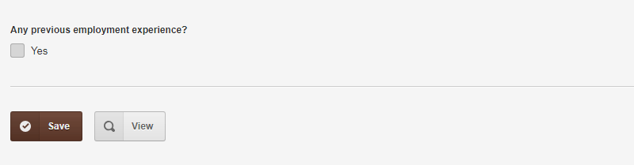
  
When the form loads, as you can see above, only one field is visible.  
It is a checkbox asking for some further information. If the user chooses not to check the box, the form can be submitted successfully without any problem.  
  
However, if the user checks the box, following is what happens -  

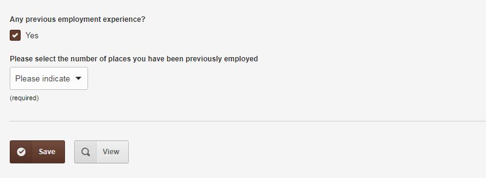

A dropdown, which was hitherto hidden, becomes visible.  
At this point, if you try to save the form it won't succeed if an option is not selected from the dropdown -  

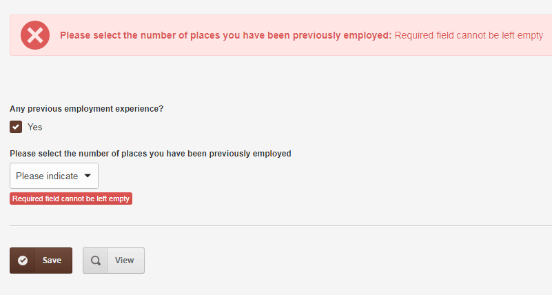

The dropdown, obviously, was internally part of the form even when the checkbox was not ticked but at that time it did not bother to enforce selecting an option when the form was posted. It is only when the checkbox was ticked that the dropdown 'came alive'.  
  
OK, moving ahead -  
select 'One' from the dropdown and you see a set of three new fields appearing on the screen -  

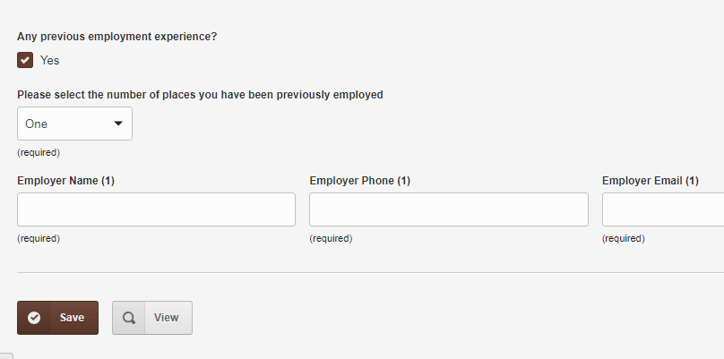

So now, the dropdown becomes the 'controller' and the three text fields its 'dependents'.  
Notice also how the three new fields are 'required' - so posting the form at this point will result in the following  

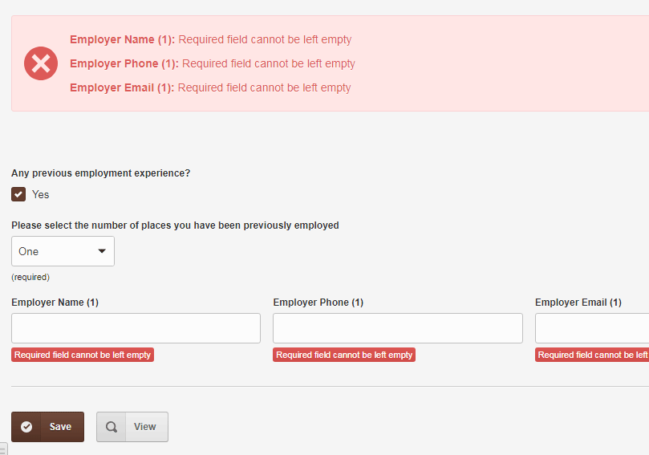

Ok, no more harping over the conditionally 'coming alive' point which should be abundantly clear by now.  
Take a look at the form displaying all its fields (with 'Three' selected from the dropdown) and we can move on to the coding part -  

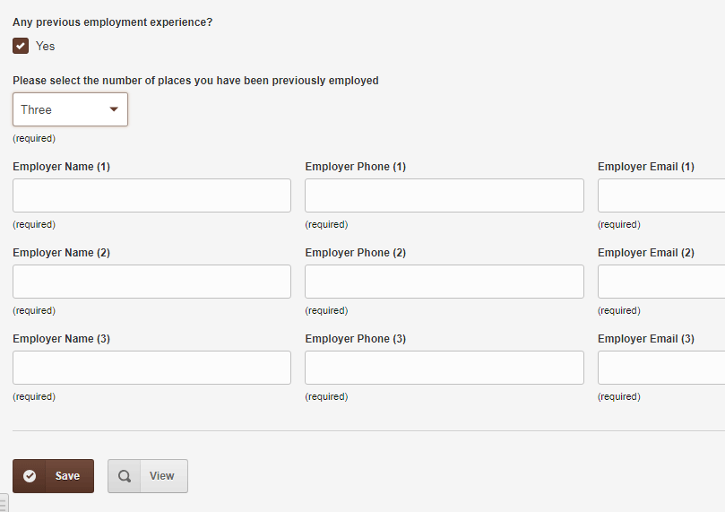

At this point let me define two terms we'll be frequently using in any discussion about conditional field -  
In the form above, the dropdown field is the 'dependent' field while the checkbox field is the 'controller' field (because, obviously, it controls the dependent dropdown).  
  
The terms, however, should be seen only in context of describing the relation between two fields.  
A field that is `'dependent'` in relation to field `'A'` can very well be a `'controller'` in relation to field `'B'`, if `'B'` happens to depend on it.  
This is what happens with the dropdown when it is seen in relation to the nine text fields following it - it now becomes the 'controller' while the text fields become its dependents.  
  
One reason for my stressing these terms is that for conditional-fields to work properly in Couch, **any 'dependent' field must always come \*after\* its 'controlling' field(s)**  when they are displayed in the form. This is because the conditional logic of a `'dependent'` depends on values submitted in the controlling fields and if the dependent happens to be displayed before them, at the point of working out the logic, the controlling field wouldn't even exist and the logic will fail.  
This limitation might necessitate making some changes to your existing templates and hence the stress on this point.  
  
### 1\. Using Conditional fields in the backend:  
Following is the code defining the editable regions *before* we begin adding the conditional logic to them -  

**Code:**

```html
<cms:template title='Conditional Fields Test'>
    <cms:editable
        type='checkbox'
        name='previous_work_experience'
        label='Any previous employment experience?'
        opt_values='Yes'
    />

    <cms:editable
        type='dropdown'
        name='previous_number_of_employers'
        label='Please select the number of places you have been previously employed'
        opt_values='Please indicate=- | One | Two | Three'
        required='1'
    />

    <cms:editable name='previous_employer1' type='row'>
        <cms:editable name='previous_employer1_name' label='Employer Name (1)' type='text' required='1' class='col-md-4' />
        <cms:editable name='previous_employer1_phone' label='Employer Phone (1)' type='text' required='1' class='col-md-4' />
        <cms:editable name='previous_employer1_email' label='Employer Email (1)' type='text' required='1' class='col-md-4' />
    </cms:editable>

    <cms:editable name='previous_employer2' type='row'>
        <cms:editable name='previous_employer2_name' label='Employer Name (2)' type='text' required='1' class='col-md-4' />
        <cms:editable name='previous_employer2_phone' label='Employer Phone (2)' type='text' required='1' class='col-md-4' />
        <cms:editable name='previous_employer2_email' label='Employer Email (2)' type='text' required='1' class='col-md-4' />
    </cms:editable>

    <cms:editable name='previous_employer3' type='row'>
        <cms:editable name='previous_employer3_name' label='Employer Name (3)' type='text' required='1' class='col-md-4' />
        <cms:editable name='previous_employer3_phone' label='Employer Phone (3)' type='text' required='1' class='col-md-4' />
        <cms:editable name='previous_employer3_email' label='Employer Email (3)' type='text' required='1' class='col-md-4' />
    </cms:editable>
</cms:template>

```

As you can see, those are standard editable region definitions (if type `'row'` seems unfamiliar, please see  [viewtopic.php?f=8&t=11023](https://www.couchcms.com/forum/viewtopic.php?f=8&t=11023). This type is now part if Couch's core.).  
  
Let us begin with making the dropdown a conditional field where it depends upon the checkbox. For brevity, I'll show only the relevant portion of the code.  

**Code:**

```html
    <cms:func _into='my_cond' previous_work_experience=''>
        hide
    </cms:func>

    <cms:editable
        type='dropdown'
        name='previous_number_of_employers'
        label='Please select the number of places you have been previously employed'
        opt_values='Please indicate=- | One | Two | Three'
        required='1'
        not_active=my_cond
    />

```

Compare the modified code to the definition of the dropdown in previously quoted code and you'll find only two differences -  
1\. The code block using `<cms:func>` is defining a function. If this appears unfamiliar, please see  [viewtopic.php?f=8&t=11368&start=10#p30174](https://www.couchcms.com/forum/viewtopic.php?f=8&t=11368&start=10#p30174)  for full discussion.  

**Code:**

```html
    <cms:func _into='my_cond' previous_work_experience=''>
        hide
    </cms:func>

```

Broadly speaking, a function is nothing more than a collection of Couch statements which can be invoked by calling that function (as it stands at the moment, our function above will simply output 'hide' when called).  
  
The function we are defining above is a little different from the ones we demonstrated in the above mentioned post. This function is 'anonymous' i.e. it does not have a fixed name of its own; rather, we store the function in a variable ('my_cond' in the code above).  
  
Compared to regular functions, anonymous functions have several advantages e.g. they can be stored in arrays, passed as parameters to other tags or even functions as simple variables. But you don't have to get into the nitty gritty of it - the only thing to understand above is that we are creating a function and storing it in a variable named `'my_cond'`.  
  
2\. The second modification to the original code is where we make use of the `'my_cond'` variable we discussed above -  

**Code:**

```html
<cms:editable
    ..
    not_active=my_cond
/>

```

As you'll remember, `'my_cond'` variable actually holds a function within it.  
In the code above, we set this function into the field's parameter named `'not_active'`.  
  
Now this is what happens when the form is being rendered by Couch and the system has to decide whether the field being rendered is `'alive'` or not -  
If the field's definition does not contain the `'not_active'` parameter, the field is a normal field and is always considered active (alive).  
If, however, that parameter is used in the field's definition and it contains a function (as is the case above), Couch goes ahead and calls the function.  
  
If the function outputs `'hide'`, it deactivates the field. If the function outputs `'show'`, it activates the field.  
As far as Couch is concerned, it is as simple as that.  
  
It is for the function (actually for us as we'll write the function) now to apply any kind of logic it wishes before deciding what directive to pass back to Couch.  
It could be checking against the database for a particular value in a particular template or it could even be checking the current time of the day or whatever. What matters to Couch is whether the function outputs 'show' or 'hide' to activate or deactivate the field.  
  
In our code above, our function is simply returning 'hide' and this will cause the dropdown to always remain inactive no matter what.  
  
Most functions would check the 'controlling' field(s) of the field being processed and make Couch activate/deactivate it accordingly. So, in our case the function should ideally check if the checkbox is ticked. If it is indeed ticked, output 'show' to activate the dropdown. If no, output 'hide' to deactivate it.  
  
The process is a lot simpler in doing than it appears in the explanation so let us do that.  
  
Please take a look again at our function's definition above and note that it has one parameter named `'previous_work_experience'`. Take a look at the editable regions being defined in the template and you'll find that `'previous_work_experience'` is the name of the checkbox field that is supposed to become the controller of the dropdown field we are currently dealing with.  
  
When Couch calls the function, it first finds all the fields specified as the function's parameters (in our case it is only one but we can have any number depending on the use-case, as we'll see shortly), gets the values currently being held in those fields and then passes those values to the function.  
  
So the code we put into our function needs only check if the values being passed to us fullfil the conditions necessary to activate the field or not and output the directive accordingly.  
  
The controlling `'previous_work_experience'` field for our dropdown is a checkbox but for just a little while let us assume it is a dropdown or a radio (you'll remember that these two, as opposed to a checkbox, can only contain a single value thus making our code a tad simpler). With that assumption, the following is the complete working code that will make the dropdown conditionally active only if the controlling field contains 'Yes' -  

**Code:**

```html
    <cms:func _into='my_cond' previous_work_experience=''>
        <cms:if previous_work_experience='Yes'>show<cms:else />hide</cms:if>
    </cms:func>

```

Not too difficult, is it?  
If you so prefer, you may use line-breaks and whitespaces to make the code more readable e.g. the following version works just the same as the one above -  

**Code:**

```html
    <cms:func _into='my_cond' previous_work_experience=''>
        <cms:if previous_work_experience='Yes'>
            show
        <cms:else />
            hide
        </cms:if>
    </cms:func>

```

Of course, our controlling field is a checkbox and can, potentially, contain multiple selected values so the actual code we'll use is as follows -  

**Code:**

```html
    <cms:func _into='my_cond' previous_work_experience=''>
        <cms:if "<cms:is 'Yes' in=previous_work_experience />">
            show
        <cms:else />
            hide
        </cms:if>
    </cms:func>

```

As you can see, we are making use of another tag (`<cms:is>`) to figure out if a particular value is contained within the checkboxes selected values or not. For those familiar with how Couch works with arrays ([viewtopic.php?f=5&t=10892](https://www.couchcms.com/forum/viewtopic.php?f=5&t=10892)), `<cms:is>` is just a shortened version of `<cms:arr_val_exists>`.  
  
Try it out and you'll find that the dependent dropdown faithfully follows its controller checkbox in being active or not.  
So that is one conditional field taken care of. Before we move on to the three groups of nine text fields that come next, allow me to bring to your notice certain points from the code we have used so far as those will pertain to all conditional fields -  
  
As we have seen, in the part of the form we applied the conditional logic so far, the checkbox was the controller field and the dropdown was its dependent. Did you notice that all the work we did above was *only* on the dependent field i.e the dropdown? The controller (checkbox) field required no amendments whatsoever.  
  
You'll see this in all conditional fields - to make a field conditional, we'll make all the required changes (i.e. creating the logic calculating function and adding it to the field) only to the dependent field. The controlling field demands nothing. So how does Couch figure out which is the controlling field? I think that should be easy for you to answer. The answer is the names of the parameters we use in the function added to the dependent field. It is these names that tie a dependent to its controller(s).  
  
Keep an eye on that point as we make rest of the fields conditional.  
  
Moving on to the text boxes, the use case demands that the first set shows up when 'One' is selected from the dropdown. When 'Two' is selected, the second row shows up *but* the first row also keeps showing. Same with the selection of 'Three' which causes the third row to show up but the first and the second row also keep showing. We have figured out the conditions needed to show these rows.  
  
So now we see that the dropdown becomes the controller and the text fields its dependent.  
It is easy to miss at this point that the three rows additionally *also* depend on the checkbox - if the checkbox is not 'Yes', they don't exist.  
This has to be explicitly stated (as we'll soon see).  
Point here being that conditionality does not cascade - simply because the dropdown is dependent on the checkbox and the text fields are dependent on the dropdown does not mean the text fields are automatically dependent upon the checkbox.  
  
So there are two controllers (the checkbox and the dropdowns) for the text fields.  
As we have seen above, the definition of the controllers needs no changes. We specify them indirectly using the parameters of the logic function.  
  
Take a look at how we make the first set of three text fields conditional depending upon two controllers -  

**Code:**

```html
    <cms:func _into='my_cond' previous_work_experience='' previous_number_of_employers=''>
        <cms:if
            "<cms:is 'Yes' in=previous_work_experience />"
            &&
            (previous_number_of_employers='One' || previous_number_of_employers='Two' || previous_number_of_employers='Three')
        >
            show
        <cms:else />
            hide
        </cms:if>
    </cms:func>

    <cms:editable name='previous_employer1' type='row'>
        <cms:editable name='previous_employer1_name' label='Employer Name (1)' type='text' required='1' class='col-md-4' not_active=my_cond />
        <cms:editable name='previous_employer1_phone' label='Employer Phone (1)' type='text' required='1' class='col-md-4' not_active=my_cond />
        <cms:editable name='previous_employer1_email' label='Employer Email (1)' type='text' required='1' class='col-md-4' not_active=my_cond />
    </cms:editable>

```

Points to note -  
1\. We have created only one function and added the same to all the three text boxes. That is perfectly ok as the three fields share the same conditions.  
2\. The function, as expected, defines two parameters - these are the names of the checkbox and the dropdown. When Couch calls the function, these parameters will be automatically filled with the then current values contained in the respective parameters.  
3\. Notice how the code within the function uses the passed parameters to figure out whether or not to make the field being processed active.  
I don't think it'd be too difficult to figure out the logic - "Show if checkbox is 'yes' and dropdown is either 'one' or 'two' or 'three'".  
Please see  [http://docs.couchcms.com/tags-reference/if.html](http://docs.couchcms.com/tags-reference/if.html)  if you need any help with the use of OR and AND logic.  
  
And with that we can wrap up the form by converting the last remaining two rows -  

**Code:**

```html
    <cms:func _into='my_cond' previous_work_experience='' previous_number_of_employers=''>
        <cms:if
            "<cms:is 'Yes' in=previous_work_experience />"
            &&
            (previous_number_of_employers='Two' || previous_number_of_employers='Three')
        >
            show
        <cms:else />
            hide
        </cms:if>
    </cms:func>

    <cms:editable name='previous_employer2' type='row'>
        <cms:editable name='previous_employer2_name' label='Employer Name (2)' type='text' required='1' class='col-md-4' not_active=my_cond />
        <cms:editable name='previous_employer2_phone' label='Employer Phone (2)' type='text' required='1' class='col-md-4' not_active=my_cond />
        <cms:editable name='previous_employer2_email' label='Employer Email (2)' type='text' required='1' class='col-md-4' not_active=my_cond />
    </cms:editable>

    <cms:func _into='my_cond' previous_work_experience='' previous_number_of_employers=''>
        <cms:if "<cms:is 'Yes' in=previous_work_experience />" && previous_number_of_employers='Three'>
            show
        <cms:else />
            hide
        </cms:if>
    </cms:func>

    <cms:editable name='previous_employer3' type='row'>
        <cms:editable name='previous_employer3_name' label='Employer Name (3)' type='text' required='1' class='col-md-4' not_active=my_cond />
        <cms:editable name='previous_employer3_phone' label='Employer Phone (3)' type='text' required='1' class='col-md-4' not_active=my_cond />
        <cms:editable name='previous_employer3_email' label='Employer Email (3)' type='text' required='1' class='col-md-4' not_active=my_cond />
    </cms:editable>

```

The changes to the last two groups are minor variations of what was required for the first group so shouldn't be difficult to understand.  
  
### 2\. Using Conditional fields on the frontend with DBFs:  
With the backend completed, let us see what it takes to use conditional fields on the frontend (in a DataBound Form).  
  
The full code for the DBF is contained in the attached files and you'll find that it is just a standard databound form as discussed in the docs ([http://docs.couchcms.com/concepts/databound-forms.html](http://docs.couchcms.com/concepts/databound-forms.html)). So, here I'll discuss only those portions of it that are specific to implementing the condition field logic.  
  
Following portion showing only the checkbox, the dropdown and the first row of textboxes should suffice for our discussion -  

**Code:**

```html
<div class="form-group">
    <label>Any previous employment experience?</label>
    <div>
        <cms:input name='previous_work_experience' type='bound' />
    </div>
</div>

<div class="form-group" id="k_element_previous_number_of_employers">
    <label for="previous_number_of_employers">Please select the number of places you have been previously employed</label>
    <div>
        <cms:input name='previous_number_of_employers' type='bound' />
    </div>
</div>

<div class="row">
    <div class="col-md-4 form-group" id="k_element_previous_employer1_name">
        <label for="previous_employer1_name">Employer Name (1)</label>
        <cms:input name='previous_employer1_name' type='bound' />
    </div>
    <div class="col-md-4 form-group" id="k_element_previous_employer1_phone">
        <label for="previous_employer1_phone">Employer Phone (1)</label>
        <cms:input name='previous_employer1_phone' type='bound' />
    </div>
    <div class="col-md-4 form-group" id="k_element_previous_employer1_email">
        <label for="previous_employer1_email">Employer Email (1)</label>
        <cms:input name='previous_employer1_email' type='bound' />
    </div>
</div>

```

As you can see, as is the norm with DBF, we are are using `<cms:input>`s with type "bound" to render our editable regions.  
There is no need to define the logic calculating function etc. again on the frontend as the 'bound' fields automatically pick those from the backend.  
  
If you submit the form at this point, you'll see that the backend enforces the 'required' status of all dependent fields depending upon what was selected in their controlling fields. What does *not* happen is the automatic hiding and showing of the fields on the front-end.  
  
That part actually makes use of some (Couch generated) JS code. While that JS is automatically included in the admin-panel forms, the same does not happen on the frontend.  
  
So while using our conditional fields on the frontend in a DBF, we need to explicitly take some steps (two to be precise) to make the fields show/hide as the controllers change.  
  
1\. Add the following at the end of the template just before the closing `</BODY>` tag -  

**Code:**

```html
<script type="text/javascript">
    //<![CDATA[
    <cms:conditional_js />
    //]]>
</script>

```

That takes care of including the JS code required to toggle the fields' visibility conditionally.  
  
2\. The JS code we added above was generated primarily for the backend and so makes an assumption regarding the DIVs (or any other element) that work as wrappers around the conditional fields (it is actually these wrappers that are hidden or shown).  
  
The assumption is that if a conditional field is named `'xyx'`, the wrapper would have the ID `'k_element_xyz'` (i.e. `'k_element_'` prefixed to the field name). That happens automatically in the backend but on the front-end you need to take care of this point yourself. This might necessitate using an extra div around existing markup.  
  
Take a look at our code above and notice how all the divs around the conditional fields have the kind of IDs I mentioned.  
  
 
> **Important:**  This point of having the wrappers with a particular ID is very easy to miss during development (happened to me a few times).  
> Anytime you find that conditional fields in a DBF are not working as expected, always check two things -  
> a. do a view-source and make sure the required JS code is being included  
> b. make sure you have given the correct IDs to the wrappers.  

That is all that needs to be done for using conditional fields in frontend DBFs.  
  
### 3\. Using Conditional fields on the frontend with normal forms:  

So far we have been only using `<cms:editable>`s as the conditional fields.  
Plain `<cms:input>`s too can be used as conditionals on frontend forms and the process is almost identical.  
  
The attached template contains a second version of the form using only regular `<cms:input>`s.  
I'll discuss here only the points that are specific to such forms.  
  
Following is a portion from the form showing the same inputs as that our DBF sample did above -  

**Code:**

```html
<div class="form-group">
    <label>Any previous employment experience?</label>
    <div>
        <cms:input name="previous_work_experience" type="checkbox" opt_values="Yes" />
    </div>
</div>

<cms:func _into='my_cond' previous_work_experience=''>
    <cms:if "<cms:is 'Yes' in=previous_work_experience />">show<cms:else />hide</cms:if>
</cms:func>

<div class="form-group" id="k_element_previous_number_of_employers">
    <label for="previous_number_of_employers">Please select the number of places you have been previously employed</label>
    <div>
        <cms:input name="previous_number_of_employers" type="dropdown" opt_values='Please indicate=- | One | Two | Three' required='1' not_active=my_cond />
    </div>
</div>

<cms:func _into='my_cond' previous_work_experience='' previous_number_of_employers=''>
    <cms:if
        "<cms:is 'Yes' in=previous_work_experience />"
        &&
        (previous_number_of_employers='One' || previous_number_of_employers='Two' || previous_number_of_employers='Three')
    >
        show
    <cms:else />
        hide
    </cms:if>
</cms:func>

<div class="row">
    <div class="col-md-4 form-group" id="k_element_previous_employer1_name">
        <label for="previous_employer1_name">Employer Name (1)</label>
        <cms:input name="previous_employer1_name" type="text" required='1' size='105' not_active=my_cond />
    </div>
    <div class="col-md-4 form-group" id="k_element_previous_employer1_phone">
        <label for="previous_employer1_phone">Employer Phone (1)</label>
        <cms:input name="previous_employer1_phone" type="text" required='1' size='105' not_active=my_cond />
    </div>
    <div class="col-md-4 form-group" id="k_element_previous_employer1_email">
        <label for="previous_employer1_email">Employer Email (1)</label>
        <cms:input name="previous_employer1_email" type="text" required='1' size='105' not_active=my_cond />
    </div>
</div>

```

You'll immediately notice that, unlike the type `'bound'` inputs we used in the DBF, these are regular inputs and so require **exactly** the same two changes as `<cms:editable>`s did in "1. Using Conditional fields in the backend" sample i.e. -  
a. Creating a function calculating the logic  
b. Adding that function to `<cms:input>` through 'not_active' parameter.  
  
Additionally, since the form is being displayed on the frontend, it will also require the two changes that "2. Using Conditional fields on the frontend with DBFs" did i.e. -  
a. Manually adding the generated JS  
b. Explicitly giving the required IDs to wrapper divs.  
  
So a normal frontend form is kind of a combo of a backend form and a frontend DBF in terms of making it use conditional fields.  
  
### 4\. Using Conditional fields as repeatable-regions  
To wrap up this discussion, let us see how we can use conditional fields with Repeatable regions ([http://docs.couchcms.com/concepts/repea ... gions.html](http://docs.couchcms.com/concepts/repeatable-regions.html)).  
  
Although conditional fields will work just the same in regular `'tabular'` repeatable regions, the newer `'stacked'` version of repeatable regions (documented at "3. Revised repeatable-regions"  [viewtopic.php?f=5&t=11105](https://www.couchcms.com/forum/viewtopic.php?f=5&t=11105)) shows their effects in a more marked manner so I'll use that in the sample code below.  
  
Place the following code in your test template -  

**Code:**

```html
<cms:repeatable name='slides' label='Slides' stacked_layout='1'>
     <cms:editable name='text' label='Slide Text' type='text' />

     <cms:editable name='slide_type' type='radio' label='Select slide type' opt_values='Image | Video' />
     <cms:editable name='image' label='Image' desc='Recommended image width 2880px' type='image' show_preview='1' preview_width='150' />
     <cms:editable name='video' label='Video Embed Code' type='textarea' height='70' />
</cms:repeatable>

```

It should result in the creation of following repeatable region -  

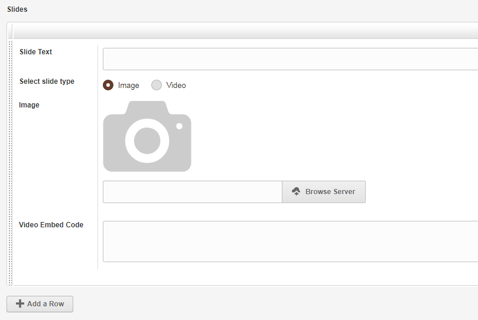

In the repeatable region, we'd like to make the `'image'` and `'video'` regions dependent on the `'slide_type'` radio buttons above them in a way that selecting `'Image'` radio button makes the image region visible while selecting `'Video'` makes the video region visible.  
  
Following is the amended code that does just that -  

**Code:**

```html
<cms:repeatable name='slides' label='Slides' stacked_layout='1'>
    <cms:editable name='text' label='Slide Text' type='text' />

    <cms:editable name='slide_type' type='radio' label='Select slide type' opt_values='Image | Video' />

    <cms:func _into='my_cond' slide_type=''>
        <cms:if slide_type='Image'>show<cms:else />hide</cms:if>
    </cms:func>
    <cms:editable name='image' label='Image' desc='Recommended image width 2880px' type='image' show_preview='1' preview_width='150' not_active=my_cond />

    <cms:func _into='my_cond' slide_type=''>
        <cms:if slide_type='Video'>show<cms:else />hide</cms:if>
    </cms:func>
    <cms:editable name='video' label='Video Embed Code' type='textarea' height='70' not_active=my_cond />
</cms:repeatable>

```

I am sure you'll find the code used above to make the regions conditionally visible very familiar.  
Here is how the repeatable region behaves now -  

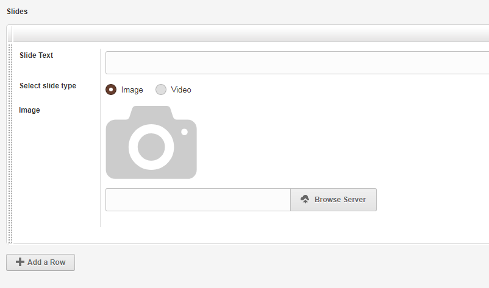

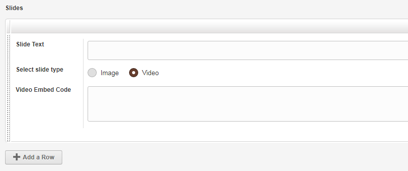

The usual caveat of the dependent fields coming after their controlling fields applies within repeatable regions also.  
  
In the code above, the two fields were dependent on a sibling field (i.e. a fellow field defined within the same repeatable region).  
If the use-case so demands, there is no problem in making the fields within a repeatable region depend on fields defined outside the repeatable region (i.e. sibling fields of the repeatable region).  
  
Following is a, somewhat contrived, use-case where we have a checkbox before the repeatable region and the fields within the repeatable regions depend on this checkbox (please notice once again that the controlling field i.e. the checkbox is set to display before its dependent fields - this time forcibly by the use of 'order' parameter).  

**Code:**

```html
<cms:editable
    type='checkbox'
    name='show_slide_type'
    label='Show slide types in table below?'
    opt_values='Yes'
    order='20'
/>
<cms:repeatable name='slides' label='Slides' stacked_layout='1' order='21'>
    <cms:editable name='text' label='Slide Text' type='text' />

    <cms:func _into='my_cond' show_slide_type=''>
        <cms:if "<cms:is 'Yes' in=show_slide_type />">show<cms:else />hide</cms:if>
    </cms:func>
    <cms:editable name='slide_type' type='radio' label='Select slide type' opt_values='Image | Video' not_active=my_cond />

    <cms:func _into='my_cond' show_slide_type='' slide_type=''>
        <cms:if "<cms:is 'Yes' in=show_slide_type />" && slide_type='Image'>show<cms:else />hide</cms:if>
    </cms:func>
    <cms:editable name='image' label='Image' desc='Recommended image width 2880px' type='image' show_preview='1' preview_width='150' not_active=my_cond />

    <cms:func _into='my_cond' show_slide_type='' slide_type=''>
        <cms:if "<cms:is 'Yes' in=show_slide_type />" && slide_type='Video'>show<cms:else />hide</cms:if>
    </cms:func>
    <cms:editable name='video' label='Video Embed Code' type='textarea' height='70' not_active=my_cond />
</cms:repeatable>

```

Following is how the checkbox affects the fields within the repeatable region -  

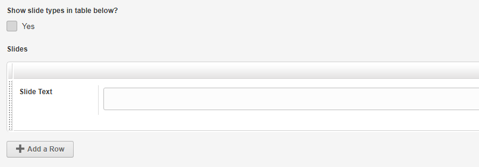

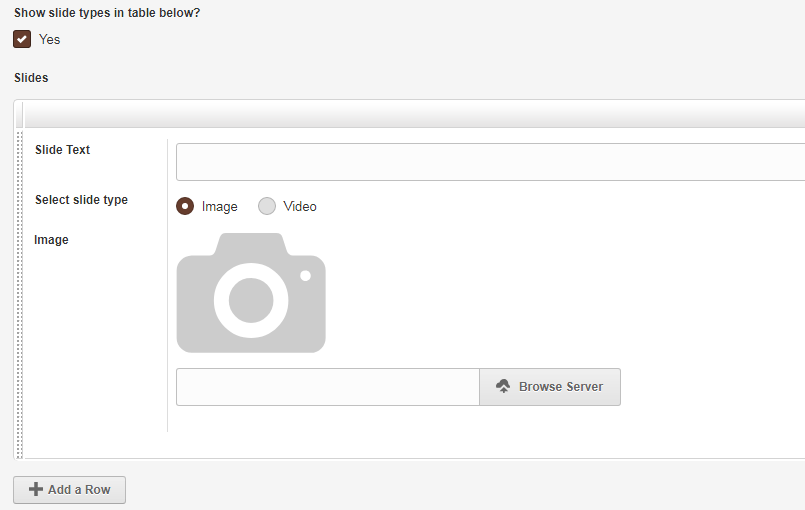

In the code above you'll see that nothing special needed to be done to make a field defined outside the repeatable region become a controlling field for the fields within. We followed the usual method of indirectly declaring the field as a controller by using its name as a parameter of the function attached with the dependent fields. Couch was smart enough to figure out that `'show_slide_type'` field is defined outside the repeatable region and use it.  
  
With that we come to the end of this tutorial.  
Before I wrap up, I wonder if you noticed that in all the examples above all the controlling fields were either of type `'checkbox'`, `'dropdown'` or `'radio'`? Also that in all the logic functions, we used no other tags except `<cms:if>`, `<cms:else>` and `<cms:is>`?  
So are there any kind of limitations on what type of fields can serve as controllers and which tags can be used in the logic functions?  
  
The answer is yes and no.  
Allow me to explain -  
as you might have figured out from the examples above, there are two separate components attached with all conditional fields -  
1. There is a backend component that figures out if a field is active or not and then accordingly enforces or skips validation checks etc.  
2. There is a frontend component comprising of JS code that shows/hides the fields depending upon the set conditions.  
  
As for the backend component, it is easy to see that it uses the logic function we attached to all dependent fields to figure out what needs to be done. However, what about the frontend JS code? We did not write any of that.  
  
Actually, Couch uses the same backend logic function and, so to say, `'transpiles'` it to automatically generate the matching JS code (do a view-source of the page and you'll see the generated code).  
  
Now this transpiling business is a tricky one and Couch cannot possibly take into consideration the potentially myriad of ways one could define the conditions within the logic function (e.g. one may decide to use `<cms:pages>` to get value from a certain page for figuring out if a field is active or not) or the ways the controlling fields behave (e.g. a popup relation field).  
  
So, if you want Couch to automatically generate the JS code for you, there are some restrictions to contend with -  
1. The controlling fields can only be of type `'checkbox'`, `'dropdown'` or `'radio'`. All other types will be ignored possibly resulting in the function not working as expected.  
2. Only the logic tags (i.e. `<cms:if>`, `<cms:else>`, `<cms:else_if>`, `<cms:not>`) and `<cms:is>` (or its equivalent `<cms:arr_val_exists>`) tags are recognized for the purpose of generating JS. All other tags are ignored - again resulting in either JS error or the function not working as expected.  
  
If, however, you are ready to code up your own frontend JS, then there are no restrictions whatsoever.  
You are free to use any type field as the controller and can use absolutely any Couch tag within the logic function.  
  
So, assuming that is what you intend to do with a certain dependent field, following is what needs to be done to make Couch skip the JS generation -  
Add the '_no_js' parameter to the logic function and set it to '1' as in the example below -  

**Code:**

```html
<cms:func _into='my_cond' slide_type='' _no_js='1'>
    <cms:if slide_type='Image'>show<cms:else />hide</cms:if>
</cms:func>

```

All the dependent fields that the function above is attached with will not have any JS generated for them.  
That is to say, that the backend component will still be applied to them but the frontend component would be skipped (the assumption being that it would be provided by you).  
  
I'd say that nine out of ten times, the auto generated JS would suffice. It is only for the rare use-cases that you'd want to disengage the auto-pilot and take over the command yourself.  
  
Hope the community finds the conditional field feature useful.  
As always, feedback is solicited.  
  
Thanks.  
  
UPDATE:  
If you wish to use your own JS for checkbox, radio or dropdowns, an easy way now is to specify that using a `<cms:alt_js>` block as follows  

**Code:**

```html
<cms:func _into='my_cond' my_folder=''>
    .. existing Couch code for backend processing ..

    <cms:alt_js>
        // JS code placed in this block will be used instead of autogenerating it using the Couch code above
    </cms:alt_js>
</cms:func>

```

### Attachments

[form.zip](../assets/img/contents/couch-22/form.zip)
