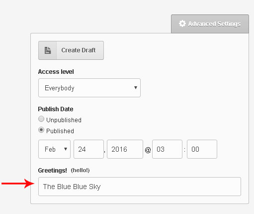

# config_form_view

Tag **config_form_view** helps in customizing the admin-panel form screen. Tag must be placed within `<cms:template>` tag-pair.<br>
It works in combination with its child tags &mdash; `<cms:field>`, `<cms:style>`, `<cms:script>`, `<cms:html>`.

## Parameters

- none

## Example
```html
<cms:config_form_view >
    <cms:field 'test'><h1>Hello</h1></cms:field>
</cms:config_form_view>
```
Example above places a dummy field in the form-view that prints a greeting.

```html
<cms:config_form_view>
    <cms:field 'k_page_title' desc='hello!' label='Greetings!' order='100' group='_advanced_settings_' class='my_class' />
</cms:config_form_view>
```

In admin-panel the **Title** field (the first displayed field, by default, in clonable templates) is no longer shown. You can find it now within the ‘Advanced settings’ dropdown.



Couch groups together the fields seen on the form page into three separate groups:

1. the system fields shown before the custom fields are placed within the `'_system_fields_'` group,
2. the system fields contained within the ‘Advanced settings’ dropdown are placed within the `'_advanced_settings_'` group
3. while all the custom fields defined by you fall within the `'_custom_fields_`' group.
Any custom groups you define (using type `'group'` editable region) are actually created as children of the `'_custom_fields_'` group with the fields within those custom groups then in turn falling beneath them - it’s an hierarchical structure.

For more information look to the [changelog of CouchCMS 2.0](../changelog/couch-20.html)

## Related Tags

* [field](./field.html)
* [config_form_view](./config_form_view.html)
