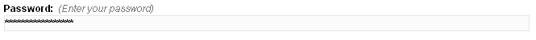

# type = 'password'

Editable region of _password_ type is very similar to the [_text_](../text.html) type. As with [_text_](../text.html) type, for this type too Couch creates a single line textbox for data input. The only difference between the two is that anything being typed into an editable region of type _password_ will appear as '\*' (asterisks). This makes it suitable for entering passwords.

An editable region of _password_ type can be defined this way -

```html
<cms:editable
 name='my_password'
 label='Password'
 desc='Enter your password'
 type='password'
/>
```

The code above will result in the following (with some password typed in) -



The contents of this region can be accessed, as with all other editable regions, by using the variable named after it -

```html
<cms:show my_password />
```

## Parameters

In addition to the parameters common to all the types of editable regions, _password_ accepts the following parameters

* width
* maxlength

### width

The width of the generated textbox can be changed by setting this parameter. For example, the following will make the textbox 200px wide -

```html
<cms:editable name='my_password' label='Password'
 desc='Enter your password'
 width='200'
 type='password' />
```

### maxlength

The maximum number of characters that can be inputted by the user in this textbox can be constrained by setting this parameter. For example, the following code will prevent the user from entering more than 40 characters -

```html
<cms:editable name='my_password' label='Password'
 desc='Enter your password'
 maxlength='40'
 type='password' />
```