# Contact Form

The _contact.html_ that comes with Aurelius provides a contact form as well as some contact details.

Let us begin by attaching Couch to this template. 
Take the usual steps to do so - 
Change the extension of _contact.html_ to make it _contact.php_ 
Add the two lines of boilerplate PHP code to enclose the contents of this file and use the template tag to change the display-name of the template.

Access _<https://www.mytestsite.com/contact.php>_ while logged on as the super-admin. 
This will hook up Couch to the template.

### Defining editable regions

As can be seen, there are three distinct parts to this template - An introductory paragraph at the top, the contact form and a sidebar containing several contact details.

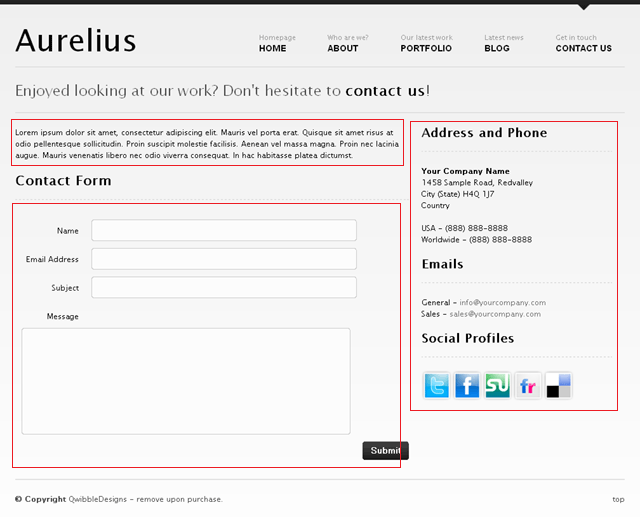

Of these three, the contact form will be handled by the Couch form and input tags. The introductory top paragraph can be easily made into an editable region. The sidebar too can be turned into an editable region - we only need to decide how granular the division needs to be. We can, if needed, create an editable region each for the _Address_, _Email_ and _Social Profiles_ sections or create one single region for the entire sidebar. 
For the purpose of this tutorial, we'll create one editable region that will span both the _Address_ as well as the _Email_ section and will sub-divide the _Social Profiles_ section into one editable region for each social site.

Let us define the editable regions for the introductory paragraph and the address and email in the sidebar by directly enclosing these parts by Couch editable tags -

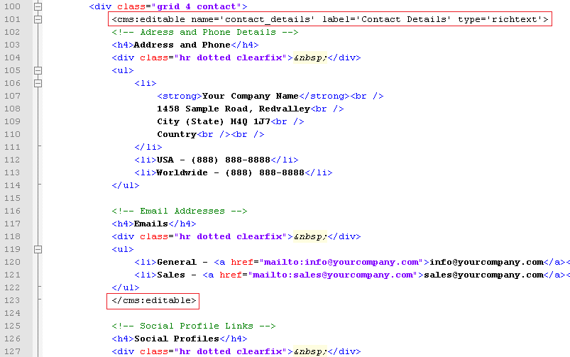

Refreshing _<https://www.mytestsite.com/contact.php>_ by revisiting it as super-admin will yield the following results for the changes made so far -

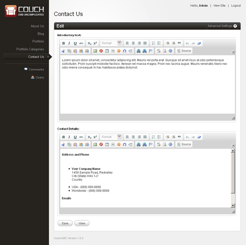

Editing any of these regions and saving the changes will cause the modifications to appear on the page immediately.

As for the _Social Profiles_ section, instead of defining its editable regions by enclosing the actual elements with the editable tags in-situ (the way we did for the previous sections), we'll define them within the template tag (the way we did in _blog_ and _portfolio_ sections) and use variables to display them. 
The reason for this is that, as you'll soon see, we'll be outputting these social links conditionally (i.e. only under certain circumstances). If we place the definition of the editable regions within conditional tags, the condition where an editable region will not be output will also cause the region to be deleted.

Make the following changes to the template tag at the top -

Note how we have grouped the five text type editable regions by creating an editable region of type group and linking the other regions to it. 
Refresh _<https://www.mytestsite.com/contact.php>_ and then visit the admin section. The following regions should appear -

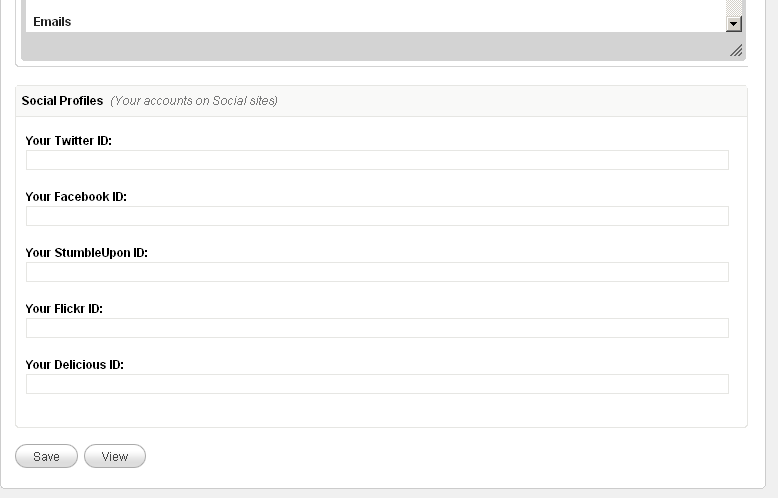

Since we have defined these editable regions in the template tag, for their contents to appear on the web page we need to use the variables representing them at the required places. 
The original HTML code for the profiles section is -

The same after using the variables set for the editable regions -

Edit the ids in the admin section and the changes should get reflected in the generated page. 
So far there has been nothing that we have not already done. 
For the sake of illustrating an important and useful technique, let us now throw a little complexity into this profiles section. 
What we wish is that a social icon should appear on the web page only if the user has placed any content within the editable region associated with the icon. If the user chooses to leave the textbox of an id blank, the icon for that should not appear.
We can deploy simple conditional tags to handle this -

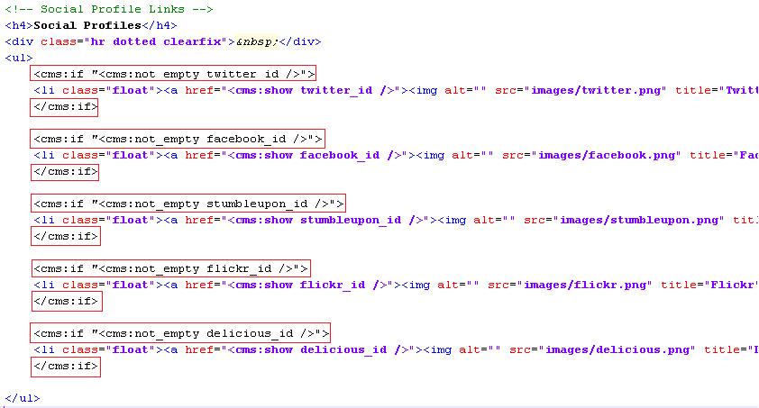

We enclose each LI element representing an icon within Couch conditional if tag that tests for the result of Couch not\_empty tag. The not\_empty tag returns 1 only if the variable it is testing has any value within it. This way an icon is output only if the associated variable is not empty.

    In case you are wondering why we are using the construct 
    **&lt;cms:if "&lt;cms:not\_empty flickr\_id /&gt;"&gt; Display this &lt;/cms:if&gt;** 
    instead of the more straightforward 
    **&lt;cms:if flickr\_id &gt; Display this &lt;/cms:if&gt;** 
    The answer is that for richtext type editable regions, even if seemingly the region is empty, the CKEditor used to create the editor silently places some **&lt;BR/&gt;** or empty **&lt;P&gt;** elements within it. This will cause the simpler version of if to fail as it will consider these empty elements to be the input of the region. 
     
    The not\_empty tag, on the other hand, strips off these empty HTML tags and returns 1 only if some value remains after this cleansing. 
    The editable regions in the case of profiles section above are not of richtext type, hence the simpler conditional check would have worked the same as the one we used.

Place values only in two of the five social links regions and icons for only those two should appear on the web page -

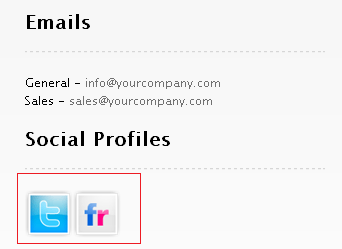

Now remove values from all the five social links regions and see the output -

As you can see that no icons appear in the output, however, the heading 'Social Profiles' still does. 
What we wish to accomplish is that this heading should appear only if at least one social link is output.

This can be achieved by enclosing the heading in a conditional tag that checks for the presence of all the five variables but we'll use another very powerful method, the technique we hinted about before, to achieve the same result.

### Buffering output

Couch has a tag named capture that can be used to enclose any arbitrary section of code. The output of the code that is enclosed within it, instead of being directly output as is normally the case, is buffered by the capture tag into any variable that you set as its 'into' parameter.

Enclose the _profiles_ section we are working on within the capture tag like this -

Notice that we are instructing the capture tag to buffer all output of its enclosed content into a variable named *profiles\_output*. Also note that at the end we are showing this *profiles\_output* variable. 
Try removing this show statement and the entire profiles block will disappear.

The value of buffering everything into one variable and then outputting the single variable is that now we can conditionally output the single variable.

What we'll do is, within the block enclosed by the capture tag, everyplace where we check whether or not a social link variable is present, if the variable is indeed present we set a variable named has\_profile to 1\. 
If even one social link variable is present, the *has\_profile* variable will be set to 1 else this variable will simply not be present. 
Finally, we'll check for this variable as the condition to output the contents buffered within *profiles\_output*.

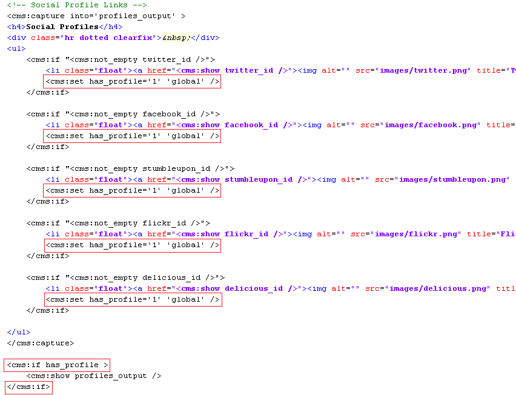

The 'global' used in each set statement instructs the set tag to set the variable at a global scope i.e. someplace where the variable is accessible throughout the page. The default scope of set is 'local' in which case a variable is set within the parent tag within which the set statement is used (if the parent tag supports scope, that is - see Scope of variables).

Now try placing values within some of the social profile editable regions. The associated icons should appear on the page. Try setting all of them to empty, and the entire block, along with the 'Social Profiles' heading should disappear.

As already admitted, this complexity was not really required for this template. We chose to describe this method anyways because we have seen this technique help us render some very complex layouts, which would have otherwise been very sticky to handle, and think that it is a technique worthwhile knowing.

What is left to configure now is the contact form itself.

### FORM

Couch has two tags that are used for building forms - the form tag and the input tag. 
If you already have an existing form, it is straightforward to port it to Couch, as we'll soon see. But first we must ask the question that if we already have an HTML form, why would we want to port it to Couch at all? 
The reason is that having a HTML form is only half the story. The other half is processing the submitted form. This includes validating all submitted values, reporting errors if any and taking the desired action after successful form submission. 
This processing of a form normally requires a custom coded PHP script, which usually is a painful task for a web-designer. 
A form created using Couch tags, on the other hand, doesn't require any such processing script. The Couch tags have enough intelligence built into themselves to handle all the required processing. 
This makes it immensely easy, even for someone who is not very comfortable with PHP, to build web forms of almost any complexity.

The _contact.php_ we have been working on already has a web form. Let us see how to port it to Couch. 
Let us begin by converting the HTML form tag to its Couch counterpart. 
The original opening HTML form tag was -

Replace the tag with its Couch equivalent -

Notice how the modification required only adding the 'cms:' prefix to the form tag. Also that the action attribute, pointing to the PHP script that processed the submitted form, is no longer needed and hence is set to blank. 
Don't forget to modify the closing tag too -

Next convert the input elements of the form to their Couch equivalents.
The original code -

After replacing with Couch tags -

Note how all the HTML input tags simply needed the 'cms:' prefix to convert them to their Couch equivalents. 
The textarea tag required a little more work. It had to be replaced by its Couch input tag that had a type of 'textarea'.

Access _<https://www.mytestsite.com/contact.php>_ and the form should appear, as well as work, exactly the same as it did with the original HTML tags. 
Uptil now we've used the Couch tags to simply generate the form. The real power of these tags, however, lies in processing the submitted form. 
The form, as it was originally built, makes use of JavaScript to validate the inputs and display the errors (try submitting the form with empty fields to see it in action). 
JavaScript is, of course, a client-side technology and cannot be relied upon for validating forms because it is only trivial to turn off JavaScript in a browser. 
Server-side validation is an absolute must for validating forms. The Couch tags we used provide this server-side validation. To see this in action we'll first have to remove the existing JavaScript validation. 
To do so, scroll up the _contact.php_ template and you'll find the following script tags -

Remove these lines and this will remove the JavaScript code that was being used for validation. 
One more step is required. The JavaScript code upon validation failure made visible the following HTML blocks -

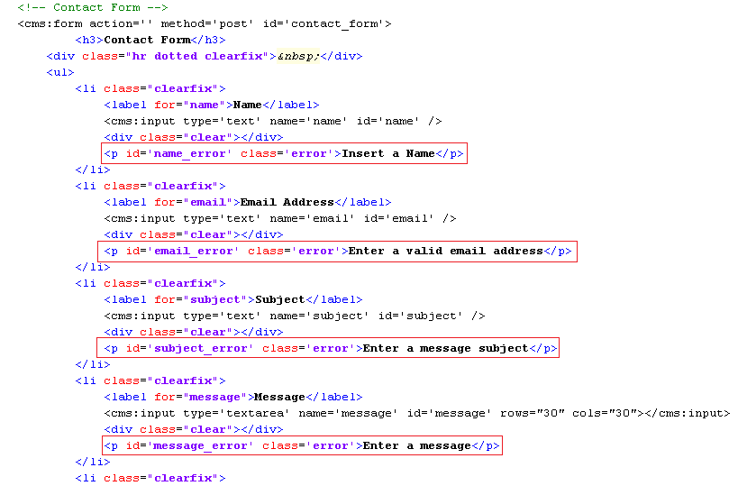

These HTML paragraphs have a class of 'error' that has been declared in the styles.css stylesheet used by _contact.php_ to have a 'display: none' style.

This makes these paragraphs normally invisible and are made visible only by the JavaScript code upon validation failure.

We need to make these error-reporting paragraphs visible by default so add the following inline code to each of them -

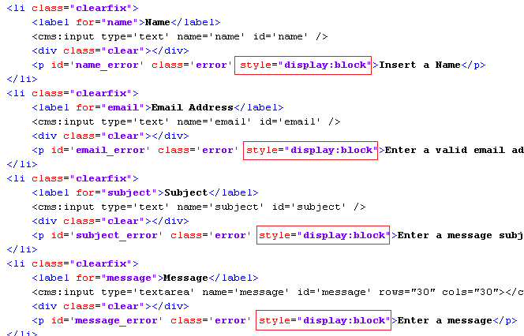

The inline style will override the existing styles and all the error-reporting paragraphs will now become permanently visible, regardless of any validation -

Don't worry though. We'll now make Couch display these messages upon validation failures.

### Validating submitted values

To make Couch validate the submitted values, the input tags need to have validation constrains placed upon them. 
The most common constrain is to make sure an input is not left empty. This can be enforced by setting the _required_ parameter of input tag to 1\. 
There are several other kinds of validations available (e.g. *min\_len*, *max\_len* etc.) which are set using the _validator_ parameter (see Forms). 
We'll use the _validator='email'_ with the input meant for email address. 
The modified code with the validation constrains in place -

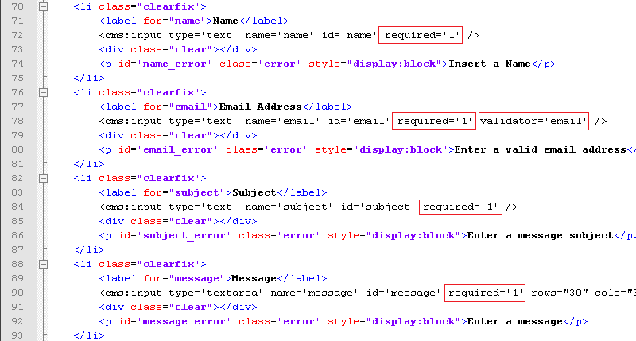

Once the validation constrains are imposed, Couch validates the submitted values accordingly at each form submission. 
If any of the constrains are violated, the form tag sets up a variable named *k\_error* to indicate this. 
Additionally, it also sets up variables named after the input tags that failed the validation, prefixing their names with a 'k\_error\_' string. Thus for example, in the case of our form here, if the input tag named 'email' fails to validate, a variable named *k\_error\_email* will be set up. 
We can test for the presence of these variables to find whether a validation error has occurred and take actions accordingly.

On the flip side of it, if all the inputs pass the validation constrains successfully, the form tag also signals this by setting up similar variables. On successful submission of form a variable named *k\_success* gets set up. In addition to it, variables named after all the input tags, with 'frm\_' prefixed to their names, are set up. These variables contain the respective submitted values.

For the form we are configuring, we'll use the 'k\_error\_tagname' variables to detect validation failures and then conditionally output the error reporting paragraphs we made visible above -

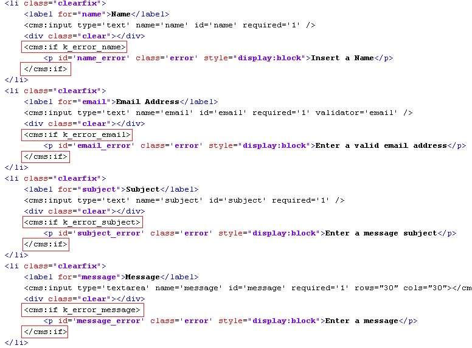

Try using the form by leaving some inputs empty and placing malformed email address. The error messages should display correctly.

Now to handle the success condition. 
We'll make use of the *k\_success* variable to detect this condition and take appropriate action. 
The form already has a message for successful condition -

We'll display it conditionally only when *k\_success* variable is found set -

Please also notice the _style="display:block"_ inline style that is needed to override the default display:none set in the stylesheet, as noted previously.

Test out the form by filling in all the values and the success message should get displayed.

### Taking action

On successful submission of form, you usually will want to do something more than just display the success message. 
In the case of this form, we'd wish to send an email to the site owner, informing him about the contact request and providing him the submitted data.

We'll use the Couch email tag to send an email to the site owner. Anything enclosed within the email tags will form the body of the email to be sent. Notice how we are using the *k\_success* variable (contains submitted values of all the inputs) to inform him of the submitted values.

The *k\_email\_from* and the *k\_email\_to* contain these values set in _config.php_ -

This wraps up the contact form section. The last template that now remains to be configured is the _index.html_ - the home page.

[That is next.](../home-page.html)
