# Portfolio

[](https://www.couchcms.com/docs/code/portfolio.zip)

Having already built the _blog_ section, building the _portfolio_ section will see us only repeating what we have already done. As such, we'll go into the details of only those steps that are new for this section.

Aurelius provides us with two files - _portfolio.html_ and *portfolio_single.html*.<br/>
*portfolio_single.html* is a single portfolio entry while _portfolio.html_ only lists the existing portfolio entries.<br/>
It should be readily apparent that *portfolio_single.html* will represent the page-view of this section while _portfolio.html_ will represent the list-view.<br/>
As with the blog, we'll use the *portfolio_single.html* as the main template for the portfolio section. This is because this view will define all the editable regions that we'll need to create in order to capture all relevant information about one single portfolio entry.

Begin by renaming _portfolio.html_ to *portfolio_list.html* and the *portfolio_single.html* to _portfolio.php_.<br/>
Enclose the entire contents of _portfolio.php_ with the boilerplate PHP code -<br/>
Place

```html
<?php require_once( 'couch/cms.php' ); ?>
```

at the very top and

```html
<?php COUCH::invoke(); ?>
```

at the very end.

Access _<https://www.mytestsite.com/portfolio.php>_ while logged on as the super-admin to attach Couch to this template.<br/>
Visit your admin section and _porfolio.php_ should now appear added to the list of templates manages by Couch.

### Defining editable regions

Let us take a look at one portfolio entry to decide which editable regions will be required to capture all its data.

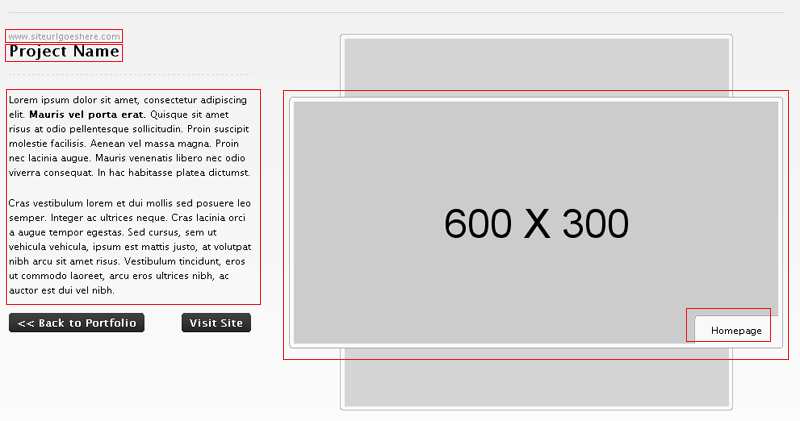

The following regions can be identified -<br/>
**1\.** The portfolio item's website<br/>
**2\.** Name<br/>
**3\.** Content<br/>
**4\.** Image<br/>
**5\.** Image's caption

Every cloned page already has a mandatory _Title_ field. We can use this field for the second item (_Name_) above so that is one editable region less.<br/>
Each portfolio item actually has three images that are displayed in the rotating carousel.<br/>
Thus we'll need to repeat the last two items listed above for two more images.<br/>
Apart from these, we'll also need an editable region to hold the thumbnail that is displayed in the list-view. We'll associate the thumbnail with Image 1\.<br/>
Each image and its caption (and the thumbnail for the first image) form a logical group hence we'll use three editable regions of type group to visually place them together.

The final list of the editable regions required and their types -<br/>
**1\.** The item's website (text)<br/>
**2\.** Content (richtext)<br/>
<br/>
**3\.** Image Group 1 (group)<br/>
**4\.** Image 1 (image)<br/>
**5\.** Image 1's thumbnail (thumbnail)<br/>
**6\.** Image 1's caption (text)<br/>
<br/>
**7\.** Image Group 2 (group)<br/>
**8\.** Image 2 (image)<br/>
**9\.** Image 2's caption (text)<br/>
<br/>
**10\.** Image Group 3 (group)<br/>
**11\.** Image 3 (image)<br/>
**12\.** Image 3's caption (text)

As we did in the _blog_ section, define all these editable regions within a template tag as follows -

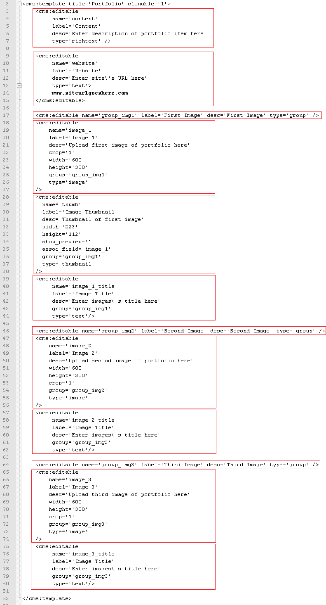

Notice that we have also declared the template as clonable.

Refresh _<https://www.mytestsite.com/portfolio.php>_ by visiting it again logged in as super-admin.<br/>
Visit the admin section to find the first default page created for you. Clicking on it should reveal that Couch has created the following editable regions as instructed -

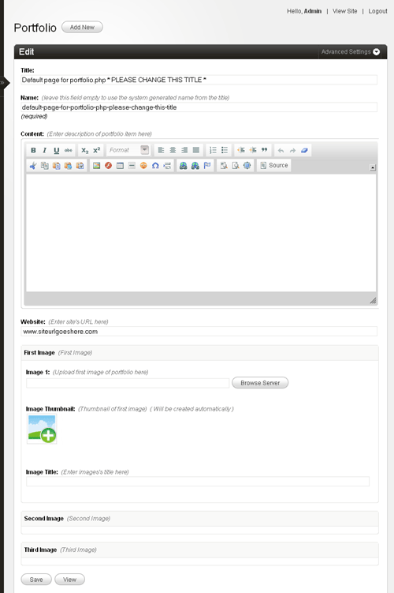

Edit the default page to create the first portfolio item.<br/>
Once you have entered and saved all data, click on 'view' to see the page.<br/>
The page-view of _portfolio.php_ should load with the URL of the cloned page being similar to -<br/>
_<https://www.mytestsite.com/portfolio.php?p=7>_<br/>
where the number after '?p=' will be the unique id of this portfolio item.

Of course, none of the data we entered in the editable regions of this page should be visible because we have not used the variables representing the editable regions in the template yet.<br/>
Let us do so now.<br/>
The original HTML code -

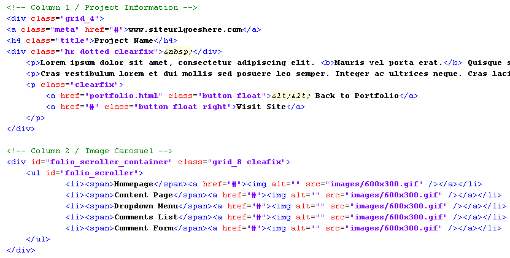

After replacing with Couch variables -

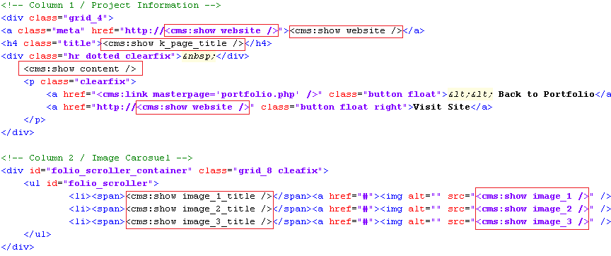

Revisit the cloned page and it should now display the contents placed in its editable regions -


That completes the page-view part of portfolio.<br/>
Let us move on to the list-view.

### The List View

As we had already decided, the *portfolio_list.html* will serve as the list view.<br/>
Move *portfolio_list.html* to the snippets folder and it is ready to be embedded within _portfolio.php_.

Just the way we handled list-view in _blog.php_, add conditional Couch tags to check for page-view and list-view and display the relevant content.<br/>
Display the existing content of _portfolio.php_ if variable *k_is_page* is set (i.e. we are handling page-view) -


else display the embedded *portfolio_list.html* (this has to be the list-view) -


Access _<https://www.mytestsite.com/portfolio.php>_ (it is the list-view because no page information is appended to the template name) and the contents of *portfolio_list.html* should appear -

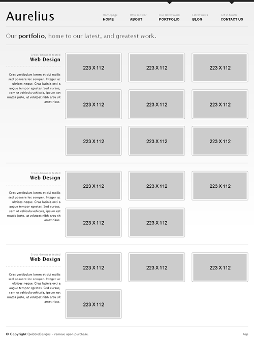

This, of course, is the static HTML contained within the embedded snippet and does not reflect the portfolio items (cloned pages) currently existing. To make this listing dynamic, we'll need to add some Couch tags to *portfolio_list.html*.<br/>
Open *portfolio_list.html* in your text editor for some modifications.

If we take a look at the static listing shown above, it can be seen that Aurelius is displaying portfolio items grouped together into three separate categories.<br/>
Categories, as we have seen in _blog.php_, can be simulated in Couch by the virtual folders.<br/>
Let us create three folders for _portfolio.php_. For the sake of simplicity, we'll name them _First Category_, _Second Category_ and _Third Category_. We already know how to create the folders. The following is the finished code -

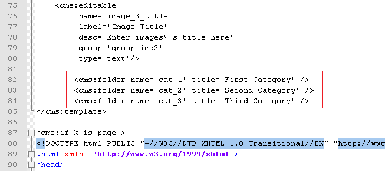

Refresh portfolio.php by revisiting _<https://www.mytestsite.com/portfolio.php>_ logged on as super-admin. Visit admin to find the three categories visible in the drop-down list -

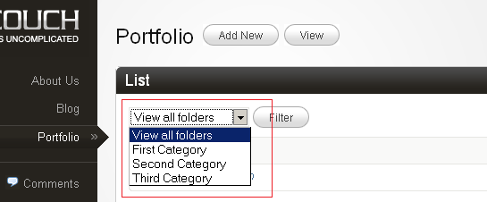

Create some more dummy portfolio items and distribute them amongst the three folders -

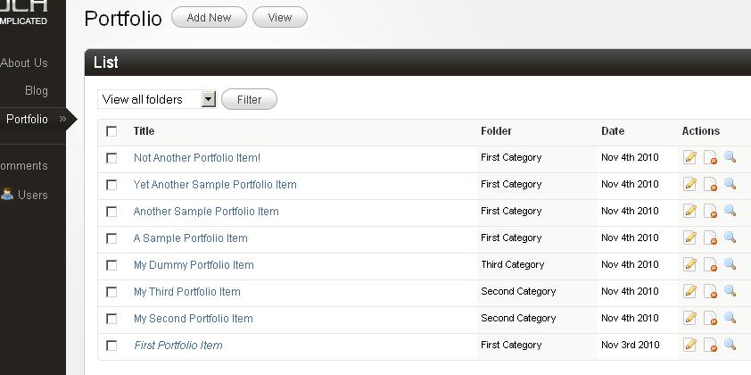

Time now to actually display the portfolio items grouped according to the categories.<br/>
We are already familiar with the Couch tags named folders and pages, which we used to enumerate the folders and cloned pages of blog.php template respectively in the previous tutorial.<br/>
We'll use both the tags for this portfolio section in much the same way. To list the portfolio items grouped together in categories, however, we'll use the pages tag nested within the folders tag. This is not something we've done so far before, so we'll go into the process in detail.<br/>
Here is how we proceed -<br/>
We'll tackle the categories first.

### Listing Categories

If you take a look at *portfolio_list.html*, you'll find the following block of code being repeated, with very minor modifications, thrice. This is a category block displaying all pages belonging to that category.

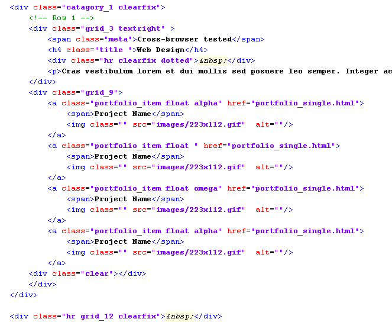

Following the pattern we set for using any enumerator tag in Couch, we'll delete two of the three blocks from *portfolio_list.html* to be left with only one block.<br/>
Then we enclose this remaining solitary block within the enumerator folders tag.<br/>
This will cause the block to be output as many times as there are folders in this template.<br/>
Finally, we make use of the variables set by the folders tag that describe each folder -


Accessing _<https://www.mytestsite.com/portfolio.php>_ now should reveal that the three categories we created for portfolio.php are being enumerated correctly.

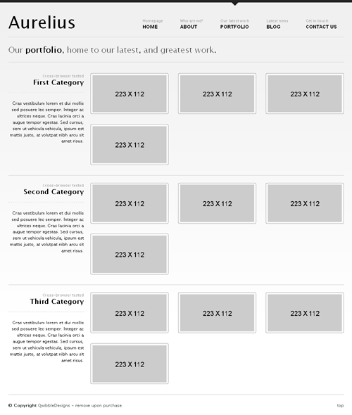

The pages being listed within each category are still static. Let us change that.

### Listing Cloned Pages

Within the category block we were working upon above, the following marked portion is displaying the four static pages entries.

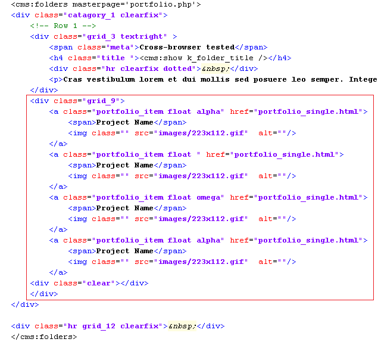

We, of course, know by now that the Couch tag used to enumerate cloned pages is the pages tag. But before we set about putting it into action by deleting all but one of the four static pages entry and enclosing it by pages tag, please take a closer look at the four pages entries.<br/>
They are identical except for their class attributes. The first entry has a class named alpha, the second has an empty equivalent class while the third has a class of omega. The entries following these have the class-names repeated in the same order. This is essential to proper 'wrap-around' the pages after every third item.<br/>
Since our enumerator tag requires only one entry to be enclosed within it and will repeat the same for each cloned page, we need to instruct it to output the right class-name for each page depending on the position of the page.<br/>
Couch provides us an easy way of doing exactly this by using the zebra tag.

The zebra tag is meant to be used within any enumerator tag and will sequentially output each of its parameters at each iteration. If the numbers of iterations (i.e. objects being enumerated) are more than the number of parameters supplied to it, the zebra tag will wrap back and start from the first parameter.

Take the usual steps of deploying the pages tag and use the zebra tag with the three class-names as parameters ('alpha', '' and 'delta')

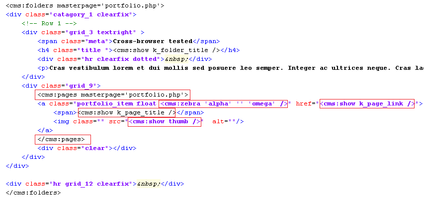

This should result in the folders tag outputting three category blocks and, within each of those blocks, the pages tag outputting the cloned pages. Thus we are using the pages tag nested within the folders tag.<br/>
The problem is that the pages tag in each of the category block is displaying all the cloned pages available and not just the pages that belong to the category in question.<br/>
We know from the blog section that the pages tag supports a parameter named folder that can be used to make it fetch pages that belong to only that folder.<br/>
The problem we have can be easily resolved by setting this folder parameter to the name of the folder being iterated. One of the variables that the folders tag sets for each folder, as it iterates through them, is the *k_folder_name* variable.<br/>
By using this variable to set the folder parameter of pages tag that was mentioned above, we can dynamically link together the folders and pages tags -

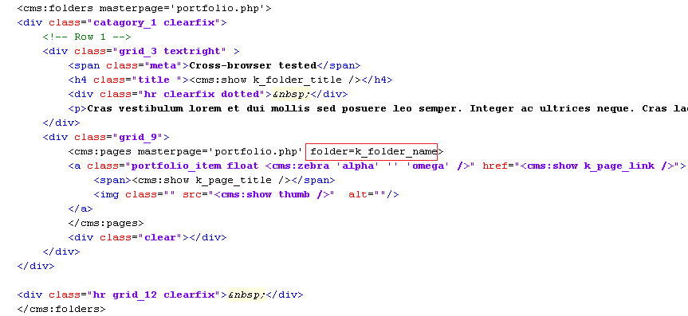

This should result in -

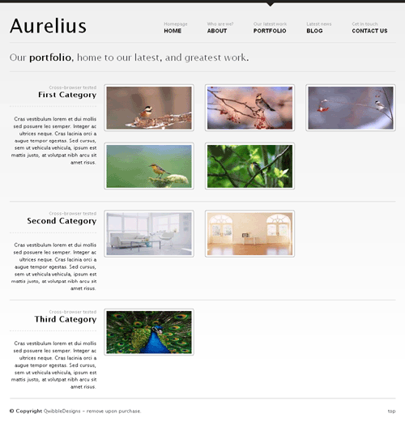

As can be seen, each of the categories now shows only the pages belonging to it.

We are now almost done with configuring the list-view. The only thing that remains is handling the description and a short blurb about each category -

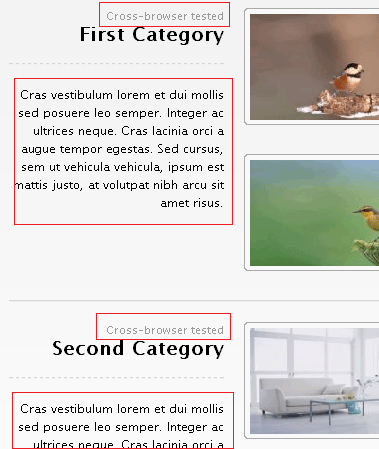

Ideally we'd want to provide the user with a richtext editor for entering the description of each folder and a single line text field for its blurb. However, Couch (currently) has no provision for adding any custom information to folders.<br/>
To get around this limitation, we'll use a method that should prove useful in several other scenarios too and hence is worth taking a look.

We'll create a separate new template containing the desired editable regions. For each folder (category) that we define for _portfolio.php_, we'll then create a matching cloned page out of this new template. In these cloned pages we'll store information about each folder.<br/>
Finally, while listing the folders, we'll fetch back the data from each associated page and display it.<br/>
This technique does entail the maintenance of a separate set of pages that need to be kept synchronized with the original objects, however, it will get the job done quite well.

So let us now create a new file named *portfolio_desc.php*. Place the mandatory Couch boilerplate code at the start and end of this file and then define the two editable regions to hold the description and blurb of the folders.<br/>
The finished code should be something like this -

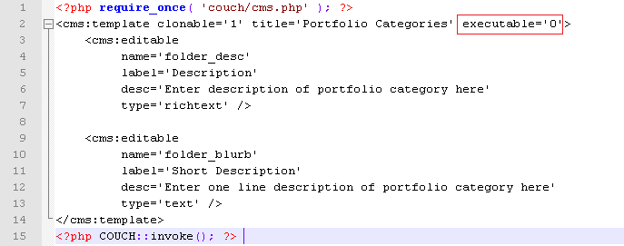

<p class="notice">
    Everything should look familiar in the code above except for the highlighted parameter that needs a little explanation.<br/>
    <br/>
    A clonable template in Couch serves three purposes -<br/>
    **1\.** It defines the URL that will be used to access the pages created from this template.<br/>
    **2\.** It defines the editable regions that will hold data belonging to each cloned page.<br/>
    **3\.** It provides the HTML code that will be used to display each page (after processing the Couch tags within it).<br/>
    <br/>
    Normally when we create any cloned template, the template serves all the three mentioned purposes. However, this is not mandatory and a template could be used to fulfill only some of these functions.<br/>
    <br/>
    The *portfolio_desc.php* template that we created is meant to serve only the second purpose mentioned in the list above.<br/>
    Its only purpose is to define the two editable regions that will then be used to store data pertaining to the folders.<br/>
    The pages cloned out of it are not meant to be accessed directly in a browser through a URL. As such, it also does not contain any HTML code whatsoever.<br/>
    <br/>
    By declaring this template as non-executable (executable='0'), we are signaling to Couch that this template is not meant to be accessed directly via a URL.<br/>
    When you are logged-in as the super-admin and access *<http://www.mytestsite.com/portfolio_desc.php>*, Couch loads up this template as a normal template (because without doing this the changes you made will not take effect). However, try accessing the same URL without being logged-in as the super-admin and you'll receive a 'HTTP 404 Page not found' error.
</p>

Access *<http://www.mytestsite.com/portfolio_desc.php>* while being logged-in as the super-admin. You'll get a blank page because the template contains no HTML. However, the purpose of this visit was to execute the Couch tags contained within the template. To verify that, visit the admin section and you should find that Couch has created the default cloned page for this template and has also created the two editable regions.


Rename the default page to one of the folders of _portfolio.php_ and create two new pages with the same names as that of the remaining two folders. Be careful - the names, not the titles, of the pages need to match that of the folders. The names of the folders, for this tutorial, were *cat_1*, *cat_2* and *cat_3*. We'll give the same names to the cloned pages of *portfolio_desc.php*.


We can now move on to display the contents of these pages while listing the categories.<br/>
This is the original code that is displaying the static information about each category -

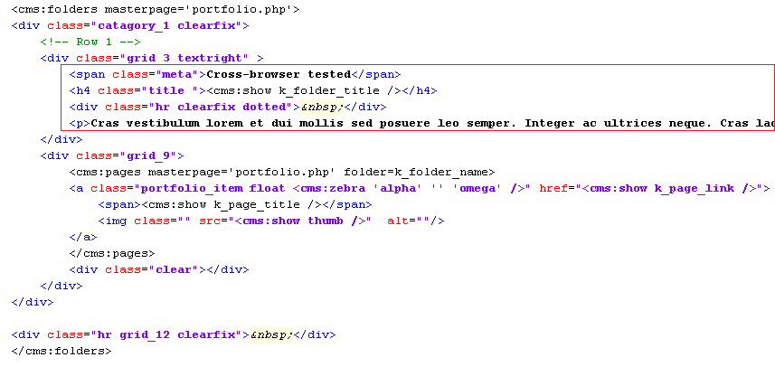

We'll make the following modifications -

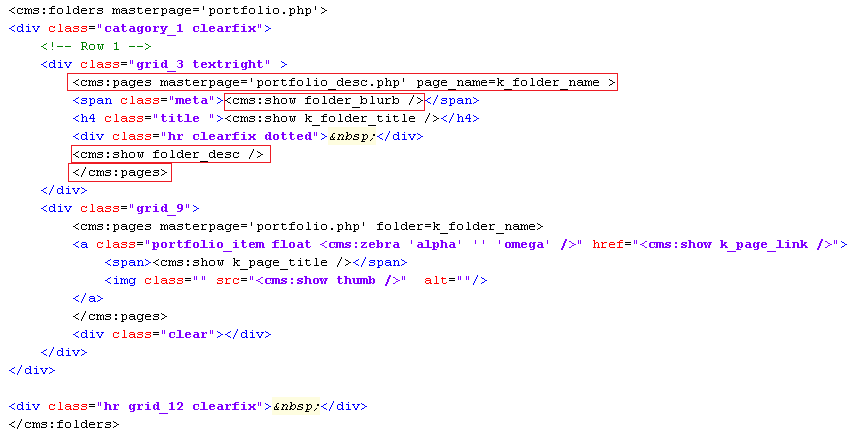

Notice how we have used the pages tag to enclose the section highlighted previously.<br/>
The pages tag, as usual, is used to fetch the cloned pages.<br/>
This time we have set the masterpage to *portfolio_desc.php* so only pages cloned from this template will be fetched. Most importantly, we have also set the *page_name* parameter to the variable *k_folder_name*. This variable, as we know, is set by the folders tag to the name of the folder being currently enumerated. Using this as the *page_name* parameter causes the pages tag to fetch only the page that has the same name as the current folder.<br/>
Since there can be only one page for the given name, the contents enclosed by the pages tag are output only once. Once we get the right page, we use the variables representing the two editable regions the usual way.

Accessing _<https://www.mytestsite.com/portfolio.php>_ will now show the category description and blurb as entered into *portfolio_desc.php* pages -

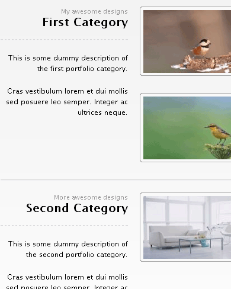

That wraps up the portfolio section.

[Next we set up the Contact Us section.](../contact-form.html)
