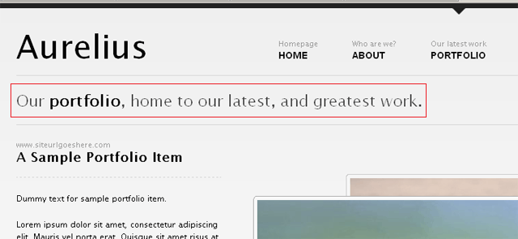
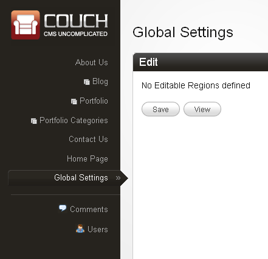
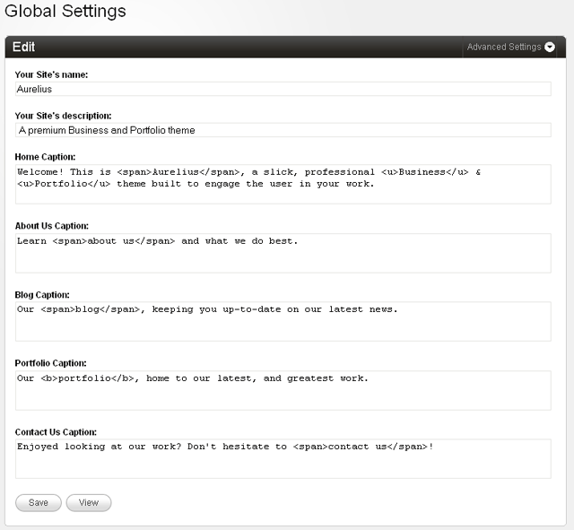

# Tying the loose ends
<br/>
### The Menu

[](https://www.couchcms.com/docs/code/final.zip)

The links in the menu at the top of all the five templates are still pointing to the original files of Aurelius (those with the _.html_ extensions). We need to link them to our new templates.

A look at the HTML code of our templates will reveal that they all have this piece of code for menu in common -


The only little difference in each is the part highlighted above. The _class="current"_ string appears only on the menu item that corresponds to the template this menu appears in. This causes a little arrow to appear below the current section.

We can easily replace the static links in the menu by those of our new templates by using the Couch link tag.<br/>
We have already encountered the link tag while configuring a previous section and know that we should always use this instead of hard coding links ourselves because it takes into account the prettyurls setting of the site and outputs links accordingly.

Thus the modified code of the menu (we are modifying _blog.php_) will become -


That is a straightforward change. The _blog_ section will now display the correct menu.<br/>
To make all the other templates do the same, we need to make the same modifications in all of them.<br/>
That is a total of 7 places to do so (the five templates and the two embedded list-views - *blog_list.html* and *portfolio_list.html*.

A cleaner approach would be to place the code for menu in a separate snippet and then embed the snippet at all the required places.<br/>
We'll take this approach.

Cut the code we have been working on above, paste it into a file and save the file as header.html in the snippets folder of Couch.<br/>
Embed the following code at all the seven locations we mentioned -

```html
<cms:embed 'header.html' />
```

Access the various sections. The menu links should work now but regardless of the section we might be currently in, the menu will show blog as the current section.<br/>
That is not surprising as the code we embedded had the _class="current"_ string in the _blog_ menu item.

To rectify the situation, let us now modify the embedded _header.html_.<br/>
We'll place some simple conditional tags to check for the current template and then output the _class="current"_ within the right menu item.<br/>
The variable to check is the *k_template_name* that is always set by Couch to indicate the template being used.<br/>
The modified code -


Visit all the sections again and the menu should work fine.<br/>
The usefulness of embedded snippets is that you need to make modifications only at a single place for the changes to appear at all the places the embed was used on.

The code we placed in the header.html also contained the name of the site as a Text Logo Aurelius.<br/>
This name appears on every page of our web site.


Change that to whatever you wish and all the templates will show the modified name.

Instead of hard-coding the site's name ourselves, a better option would be to give the client a way to do so.<br/>
The question is how.<br/>
Creating an editable region for it, the way we have done so far, will not work because this item belongs to multiple templates and not to single one.<br/>
A similar problem will arise if we were to make, for example, the highlighted region in the portfolio template below, editable by the client.



We cannot do so by creating an editable region for it in _portfolio.php_ because in that case any changes made to it would belong to any one single portfolio item - not globally to the template itself.

### Global values

The solution to these global items is creating a separate template for then altogether.<br/>
We'll define the editable regions for all globally required values in this template. The user can edit the values here and then we can simply fetch these values and use them anywhere we desire.<br/>
Since this template will only be used to hold editable values and will never be accessed directly through a URL, we can declare it to be non-executable (we have covered this in a previous tutorial).

Create and add a new file named _globals.php_ to our existing templates.<br/>
Add the mandatory PHP code to it to attach Couch to it -


Access _<https://www.mytestsite.com/globals.php>_ as super-admin and then visit the admin section.<br/>
Our new template should now be available.



#### Setting global values

We can now define all the editable regions that will hold the global values.<br/>
We have already discussed the site's name. We'll create one to hold a one-line site's description. Each of the five templates has a catch-line each. We'll create editable regions for these too.<br/>
The finished code should look like this -


Refresh _<https://www.mytestsite.com/globals.php>_ still logged-in as the super-admin to make Couch pick up the changes.<br/>
Visiting the admin panel should reveal the following editable regions -



That is half of our work done. We can now get the values in. Let us see how to get those values out and use them in the templates.

#### Fetching global values

There are two different methods of fetching in the global values, We'll describe both -<br/>
**a.** The first method uses the regular Couch pages tag that we have used several times so far.<br/>
Somewhere at the start of a template, use the pages tag and specify _globals.php_ as the masterpage. _globals.php_ is non-clonable, so the pages tag will fetch in the values of all the editable regions defined for the template.


The variables set by the pages tag are available for use only within the opening and closing components of the pages tag. We want to use them at other parts of the template and hence we copy their values to new variables. These new variables are specified to have a global scope, which makes them available everywhere on the page.

Notice in the code above how we are copying the value of the variable *site_name*, containing the value of the editable region by the same name, into a variable named *g_site_name* (we can use any arbitrary name). The *g_site_name* has been specified to have a global scope hence, unlike variable *site_name*, can be used even outside the pages tag anywhere in the template.

The new global variable can now be in the regular manner.<br/>
For example, the following code in the embedded _header.html_


becomes


**b.** The first method given above is good to fetch in all global values in one fell sweep but has the drawback of having to place the code using the pages tag somewhere at the start of every template where the values are to be used.<br/>
Sometimes you need to show only a few values from the global template. For such cases you can use the Couch get_custom_field tag to directly fetch the variable's value. This tag takes as parameters the name of the variable to be fetched, the template's name and the page's name if the template is clonable.<br/>
Since our _globals.php_ template is non-clonable, we can skip the cloned page's name and simply state -

```html
<cms:get_custom_field 'site_name' masterpage='globals.php' />
```

Thus the code to display the site's name in header.html becomes -


Since for our templates we'll be mainly displaying only solitary global values. we'll use the second method.

For example, to fix the caption for _about.php_, change the following code -


to


Similarly fix the captions for all the other templates.

One final thing remains to be fixed before wrapping up everything - the text that appears in the title bar of the Brower.<br/>
Of course, it is the HTML title tag that shows up there and it differs from template to template.

We'll list the original code along with the modified code of a couple of templates.

**index.php**<br/>
Original -


Modified -


<br/>**portfolio.php**<br/>
Original -


Modified -


<br/>**portfolio_list.html**<br/>
Original -


Modified -


List views don't have a single item to display the title of, so we remove the item name from the title.

You can similarly modify the rest of the templates.

### PrettyURLs

With this, all the templates in Aurelius are finally fully configured.<br/>
Before handing this site over to the client, however, you'd want to turn on the prettyurls for it.<br/>
Please see Couch's documentation that shows you in detail how to do so.<br/>
Once you complete the steps detailed in the documentation, visit all the templates again to see how the URLs have changed.<br/>
You'll immediately notice a problem - except for the home page, in all the other templates the CSS files do not load properly with the new prettyurls.<br/>
The reason lies in the original code of Aurelius -


As you can see, the hrefs of the stylesheets are given in relative format. With prettyurls turned on, once the URL of any containing page changes, so do these links.<br/>
We need to make the hrefs absolute. To do so, modify the code shown above to the following in all the templates (don't forget the embedded *blog_list.html* and *portfolio_list.html* -


_portfolio.php_ will also need this fixing of relative links for the .js files -


With these changes, the CSS files should now load properly in all the templates.

### Parting words

This brings us finally to the end of this tutorial ([Download the finished code](https://www.couchcms.com/docs/code/final.zip)).<br/>
We started with a plain HTML template and transformed it into a dynamic, fully CMS enabled site that even the most tech-challenged client should be able to manage easily.<br/>
The real beauty of all this was that we were able to accomplish it without writing any PHP at all (except for the two lines that remain the same for every template).<br/>
There is a lot more that you can do with Couch. It is a highly flexible system and there are several ways of accomplishing the same thing in it. Please take a look at the [documentation](../../index.html) for a fuller treatment of all its features.

Good-bye and relax! You are on the Couch now!
